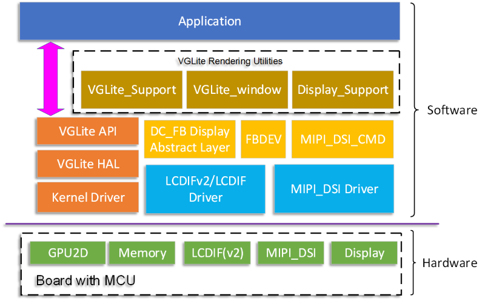
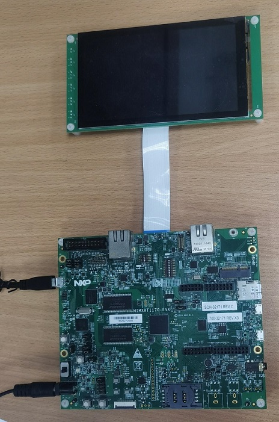

# NXP Application Code Hub
[](https://www.nxp.com)

## VGLite examples
The VGLite graphics API is platform-independent, lightweight, and used to control 2D GPU hardware in i.MX RT
platforms. It supports 2D vector-based and 2D raster-based operations. it is able to provide maximum 2D vector/raster rendering performance with minimum memory footprint. VGLite API Reference Manual can be download from [nxp.com](https://www.nxp.com/docs/en/reference-manual/IMXRTVGLITEAPIRM.pdf).

The VGLite examples focus on how to program with VGLite API including vglite initialization, pixel buffer allocation, transformation matrix control, vector path draw, gradient draw, blit operations with compositing/blending, and stroke operations. The examples of using elementary API and multitask are also provided. 

All examples ues the same code frame. Below's the block of software stack of VGLite examples. 



An example uses VGLite API to render vector objects and bitmaps on the pixel buffers. There are display components used to show the rendered graphics in the pixel buffer on the screen, that include display controller driver, MIPI DSI driver, frame buffer (FB) manager, display abstract layer. There are also some VGLite rendering utilities to create display device and window where the VGLite renders graphics objects to.  

#### Boards: MIMXRT1170-EVK, MIMXRT1170-EVKB
#### Categories: Graphics
#### Peripherals: DISPLAY
#### Toolchains: MCUXpresso IDE

## Table of Contents
1. [Software](#step1)
2. [Hardware](#step2)
3. [Setup](#step3)
4. [Results](#step4)
5. [FAQs](#step5) 
6. [Support](#step6)
7. [Release Notes](#step7)

## 1. Software<a name="step1"></a>

The software of VGLite examples is delivered in raw source files and MCUXpresso IDE projects.
- MCUXpresso SDK 2.14.0
- MCUXpresso IDE, version is 11.8.0 or later

There are  20 examples provided for your reference:
- [SimplePath](./evkmimxrt1170_01_SimplePath/README.md) demonstrates the code structure and the basic flow of a VGLite API program. The application fills the blue backround, draw a while rectangle in the middle of screen, then draw a red triangle using simple path segment.
- [QuadraticCurves](./evkmimxrt1170_02_QuadraticCurves/README.md) is similar to [SimplePath](./evkmimxrt1170_01_SimplePath/README.md)but using more path segments to draw a curve.
- [Stroked CubicCurves](./evkmimxrt1170_03_Stroked_CubicCurves/README.md) draws the stroked path with different end cap styles and different line join styles.
- [LinearGradient](./evkmimxrt1170_04_LinearGradient/README.md) draws a path and fills it with a linear gradient according to a specified fill rule. The linear gradient draw in [LinearGradient](./evkmimxrt1170_04_LinearGradient/README.md) is implemented by the ```vg_lite_draw_pattern``` API.
- [RadialGradient](./evkmimxrt1170_05_RadialGradient/README.md) draws a path and fills it with a radial gradient according to the specified fill rule. The path is drawn four times with different spread modes.
- [LinearExtGradient](./evkmimxrt1170_06_LinearExtGradient/README.md) draws a path and fills with a linear gradient four times with different spread modes. Extended linear gradient is supported with hardware. It is not available on **i.MX RT500** but **i.MX RT1170** and **i.MX RT1160**.
- [FillRules](./evkmimxrt1170_07_FillRules/README.md) demonstrates the effect of different fill rules.
- [BlitColor](./evkmimxrt1170_08_BlitColor/README.md) uses ```vg_lite_blit``` API to composite an image to background. The image is composited twice. The second composition is done by multipying a mix color. 
- [Alpha Behavior](./evkmimxrt1170_09_AlphaBehavior/README.md) demonstrates the effect of different blending modes while using ```vg_lite_blit``` to composite an image to background.
- [Glyphs](./evkmimxrt1170_10_Glyphs/README.md) simply uses ```vg_lite_blit``` API to implement the alpha glyph/text.
- [FreeSizeBuffers](./evkmimxrt1170_11_FreeSizeBuffers/README.md) draws 5 color bars with different width values and different colors. 
- [BlitRect](./evkmimxrt1170_12_BlitRect/README.md) renders a sequence of numbers using ```vg_lite_blit``` that blits the partial rectangle eara of a source image to the target buffer.
- [PatternFill](./evkmimxrt1170_13_PatternFill/README.md) demonstrates to use ```vg_lite_draw_pattern``` to draw a path and fill it with different pattern modes.
- [UI](./evkmimxrt1170_14_UI/README.md) simulates a UI that shows 6 icons and a highlight icon that's selected.
- [EVOLoading](./evkmimxrt1170_15_EVOLoading/README.md) uses **Elementary** rendering library that uses VGLite to render EVO vector object that's generated by the VGLite toolkit from a SVG file.
- [EVOExtra](./evkmimxrt1170_16_EVOExtra/README.md) is similar to [EVOLoading](./evkmimxrt1170_15_EVOLoading/README.md) by adding a fill rule for each vector path.
- [EBO](./evkmimxrt1170_17_EBO/README.md) demonstrates using **Elementary** library to render a EBO object that's an image object.
- [Cube](./evkmimxrt1170_18_Cube/README.md) uses 2.5D VGLite to simulate a 3D cube rotation. 
- [Fone](./evkmimxrt1170_19_Font/README.md) uses VGLite text drawing API to render the embedded font in the SVG file.
- [Multitask](./evkmimxrt1170_20_Multitask/README.md) demonstrates the usage of VGLite API in the two tasks to render respective graphics objects independently.


## 2. Hardware<a name="step2"></a>

- [MIMXRT1170-EVK](https://www.nxp.com/design/development-boards/i-mx-evaluation-and-development-boards/i-mx-rt1170-evaluation-kit:MIMXRT1170-EVK) (all Rev boards are supported)
- RK055HDMIPI4M or [RK055HDMIPI4MA0](https://www.nxp.com/part/RK055HDMIPI4MA0) MIPI display panel
- Micro USB Cable
- Personal computer



## 3. Setup<a name="step3"></a>
1. Connect a USB cable between the host PC and the OpenSDA USB ort on the target board.
1. Open a serial terminal with the following settings:
   - 115200 baud rate
   - 8 data bits
   - No parity
   - One stop bit
   - No flow control
1. Open MCUXpresso IDE and import the examples
1. Change the display definition in display_support.h for your display panel.
1. Build the selected project of example.
1. Download the built image to the board through debug probe USB port and run the example.

## 4. Results<a name="step4"></a>

The similar log below shows the output of the examples in the terminal window:
```
60 frames in 1060 mSec: 56.603 FPS
60 frames in 1055 mSec: 56.872 FPS
60 frames in 1060 mSec: 56.603 FPS
```
When example is runing, some graphics contents are rendered on the screen. Detailed result of examples are described in their domcument:
- [SimplePath](./evkmimxrt1170_01_SimplePath/README.md) 
- [QuadraticCurves](./evkmimxrt1170_02_QuadraticCurves/README.md) 
- [Stroked CubicCurves](./evkmimxrt1170_03_Stroked_CubicCurves/README.md)
- [LinearGradient](./evkmimxrt1170_04_LinearGradient/README.md)
- [RadialGradient](./evkmimxrt1170_05_RadialGradient/README.md)
- [LinearExtGradient](./evkmimxrt1170_06_LinearExtGradient/README.md) 
- [FillRules](./evkmimxrt1170_07_FillRules/README.md)
- [BlitColor](./evkmimxrt1170_08_BlitColor/README.md)
- [Alpha Behavior](./evkmimxrt1170_09_AlphaBehavior/README.md) 
- [Glyphs](./evkmimxrt1170_10_Glyphs/README.md)
- [FreeSizeBuffers](./evkmimxrt1170_11_FreeSizeBuffers/README.md)
- [BlitRect](./evkmimxrt1170_12_BlitRect/README.md)
- [PatternFill](./evkmimxrt1170_13_PatternFill/README.md)
- [UI](./evkmimxrt1170_14_UI/README.md)
- [EVOLoading](./evkmimxrt1170_15_EVOLoading/README.md)
- [EVOExtra](./evkmimxrt1170_16_EVOExtra/README.md) 
- [EBO](./evkmimxrt1170_17_EBO/README.md)
- [Cube](./evkmimxrt1170_18_Cube/README.md)
- [Fone](./evkmimxrt1170_19_Font/README.md)
- [Multitask](./evkmimxrt1170_20_Multitask/README.md)

## 5. Support<a name="step5"></a>

If you have any qustions or find a bug, please enter an issue in the issues tab of this GitHub repository.

#### Project Metadata
<!----- Boards ----->
[](https://github.com/search?q=org%3Anxp-appcodehub+MIMXRT1170-EVK+in%3Areadme&type=Repositories) [](https://github.com/search?q=org%3Anxp-appcodehub+MIMXRT1170-EVKB+in%3Areadme&type=Repositories)

<!----- Categories ----->
[](https://github.com/search?q=org%3Anxp-appcodehub+graphics+in%3Areadme&type=Repositories)

<!----- Peripherals ----->
[](https://github.com/search?q=org%3Anxp-appcodehub+display+in%3Areadme&type=Repositories)

<!----- Toolchains ----->
[](https://github.com/search?q=org%3Anxp-appcodehub+mcux+in%3Areadme&type=Repositories)

Questions regarding the content/correctness of this example can be entered as Issues within this GitHub repository.

>**Warning**: For more general technical questions regarding NXP Microcontrollers and the difference in expected funcionality, enter your questions on the [NXP Community Forum](https://community.nxp.com/)

[](https://www.youtube.com/@NXP_Semiconductors)
[](https://www.linkedin.com/company/nxp-semiconductors)
[](https://www.facebook.com/nxpsemi/)
[](https://twitter.com/NXP)

## 6. Release Notes<a name="step6"></a>
| Version | Description / Update                           | Date                        |
|:-------:|------------------------------------------------|----------------------------:|
| 1.0     | Initial release on Application Code Hub        | September 18<sup>th</sup> 2023 |

