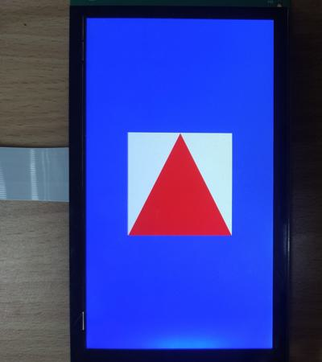

# evkmimxrt1170_01_SimplePath

Clear an offscreen with white color and draw a red triangle on it, then blit it to the center of display that has a blue background.

## Hardware Preparation

If using the **MIPI** interface, connect the LCD displayer to **J48** on the MIMXRT1170-EVK board. Connect 5V power to **J43**, set **J38** to **1-2**, and turn on the power switch **SW5**.

## Software Preparation

Now three LCD displayers are supported, which are defined in [**display_support.h**](../common/board/display_support.h):

``` C
#define DEMO_PANEL_RK055AHD091 0 /* 720 * 1280, RK055AHD091-CTG(RK055HDMIPI4M) */
#define DEMO_PANEL_RK055IQH091 1 /* 540 * 960,  RK055IQH091-CTG */
#define DEMO_PANEL_RK055MHD091 2 /* 720 * 1280, RK055MHD091A0-CTG(RK055HDMIPI4MA0) */
```

Use the macro **DEMO_PANEL** to select the LCD panel you are using, the default panel is **RK055AHD091-CTG** configured in the display_support.h:

``` C
#define DEMO_PANEL DEMO_PANEL_RK055AHD091
```

For example, if your LCD panel is **RK055MHD091A0-CTG**, change the macro **DEMO_PANEL** definition as following:

``` C
#define DEMO_PANEL DEMO_PANEL_RK055MHD091
```

The source code is in [**SimplePath.c**](./source/SimplePath.c), where the *main* function first configures clocks, pins, etc. **freerots** is deployed in the example. **vglite_task** is created and scheduled to execute VGLite initialization and drawing task.

## VGLite Initialization

Before drawing, several functions are executed to do initialization:

* **`vg_lite_init`** initializes VGLite and configures the tessellation buffer size, which is recommended to be the size of the most commonly rendered path size. 
In this project, it's defined by

    ``` C
    #define OFFSCREEN_BUFFER_WIDTH  400
    #define OFFSCREEN_BUFFER_HEIGHT 400

    error = vg_lite_init(OFFSCREEN_BUFFER_WIDTH, OFFSCREEN_BUFFER_HEIGHT);
    ```

* **`vg_lite_set_command_buffer_size`** sets the GPU command buffer size (optional).

* **`vg_lite_allocate`** allocates the render buffer, whose the input parameter is **vg_lite_buffer_t** structure defining width, height, and color format, etc.

## Drawing Task

The path drawing opcodes (1st column) and arguments (other columns) are defined in the array **pathData**, such as

``` C
static int32_t pathData[] = {
    2, 0, 400,    //Move to (0, 400)
    4, 400, 400,  //Line from (0,400) , to (400, 400)
    4, 200, 0,    //Line from (400, 400) to (200, 0)
    4, 0, 400,    //Line from (200, 0) to (0, 400)
    0,
};
```

And **vg_lite_path_t** structure describes path data's bounding box, quality, coordinate format, etc., such as

``` C
static vg_lite_path_t path = {
    {0, 0,              // left,top
    400, 400},          // right,bottom
    VG_LITE_HIGH,       // quality
    VG_LITE_S32,        // 
    {0},                // uploaded
    sizeof(pathData),   // path length
    pathData,           // path data
    1                   // path changed
};
```

In drawing task, there are following functions:

* **`vg_lite_clear`** clears the render buffer with a solid color (**ABGR format**). 
In this project, the rendered area is filled with white color by

    ``` C
    vg_lite_clear(&renderTarget, NULL, 0xFFFFFFFF);
    ```

    And the full screen is filled with blue color by

    ``` C
    vg_lite_clear(rt, NULL, 0xFFFF0000);
    ```

* **`vg_lite_identity`** resets the specified transformation matrix, which is uninitialized or previously modified by functions of `vg_lite_translate`, `vg_lite_rotate`, `vg_lite_scale`.

* **`vg_lite_draw`** performs a 2D vector draw operation, drawing input path data with the specified fill rule, transformation matrix, blend mode, and fill color, etc. 
This project fills the above path with red color by

    ``` C
    error = vg_lite_draw(&renderTarget, &path, VG_LITE_FILL_EVEN_ODD, &matrix, VG_LITE_BLEND_NONE, 0xFF0000FF);
    ```

* **`vg_lite_translate`** translates draw result by input coordinates with transformation matrix. 
The path in this project is moved by

    ``` C
    vg_lite_translate(DEMO_BUFFER_WIDTH/2 - 200, DEMO_BUFFER_HEIGHT/2 - 200, &matrix);
    ```

* **`vg_lite_blit`** finally copies the source image to the destination window with the specified blend mode and filter mode, determining the showing of objects. 
In this project, **VG_LITE_BLEND_SRC_OVER** blend mode is selected to make source image placed on the background:

    ``` C
    error = vg_lite_blit(rt, &renderTarget, &matrix, VG_LITE_BLEND_SRC_OVER, 0, mainFilter);
    ```

Once an error occurs, cleaning work is needed including the following functions:

* **`vg_lite_free`** frees the allocated render buffer.

    ``` C
    vg_lite_free(&renderTarget);
    ```

* **`vg_lite_clear_path`** clears path data uploaded to GPU memory.

    ``` C
    vg_lite_clear_path(&path);
    ```

* **`vg_lite_close`** finally frees up the entire memory initialized earlier by the `vg_lite_init` function.

    ``` C
    vg_lite_close();
    ```

## Run

Compile firstly, and use a Micro-USB cable to connect PC to **J86** on MIMXRT1170-EVK board, then download the firmware and run. 

If it's successful, the correct image will show on the displayer:



And FPS information will be sent through UART serial port continuously. The correct UART configuration is

* 115200 baud rate
* 8 data bits
* No parity
* One stop bit
* No flow control