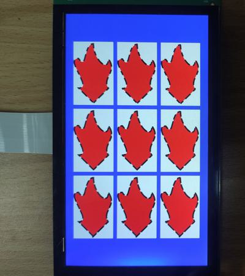

# evkmimxrt1170_03_Stroked_CubicCurves

Clear the offscreen with white color and draw nine red objects on it. Nine red objects have black strokes with different end cap and line join styles. Then blit this offscreen to the displayer that has a blue background.

## Hardware Preparation

If using the **MIPI** interface, connect the LCD displayer to **J48** on the MIMXRT1170-EVK board. Connect 5V power to **J43**, set **J38** to **1-2**, and turn on the power switch **SW5**.

## Software Preparation

Now three LCD displayers are supported, which are defined in [**display_support.h**](../common/board/display_support.h):

``` C
#define DEMO_PANEL_RK055AHD091 0 /* 720 * 1280, RK055AHD091-CTG(RK055HDMIPI4M) */
#define DEMO_PANEL_RK055IQH091 1 /* 540 * 960,  RK055IQH091-CTG */
#define DEMO_PANEL_RK055MHD091 2 /* 720 * 1280, RK055MHD091A0-CTG(RK055HDMIPI4MA0) */
```

Use the macro **DEMO_PANEL** to select the LCD panel you are using, the default panel is **RK055AHD091-CTG** configured in the display_support.h:

``` C
#define DEMO_PANEL DEMO_PANEL_RK055AHD091
```

For example, if your LCD panel is **RK055MHD091A0-CTG**, change the macro **DEMO_PANEL** definition as following:

``` C
#define DEMO_PANEL DEMO_PANEL_RK055MHD091
```

The source code is in [**SimplePath.c**](./source/SimplePath.c), where the *main* function first configures clocks, pins, etc. **freerots** is deployed in the example. **vglite_task** is created and scheduled to execute VGLite initialization and drawing task.

## VGLite Initialization

Before drawing, several functions are executed to do initialization:

* **`vg_lite_init`** initializes VGLite and configures the tessellation buffer size, which is recommended to be the size of the most commonly rendered path size. 
In this project, it's defined by

    ``` C
    #define OFFSCREEN_WIDTH  200
    #define OFFSCREEN_HEIGHT 320
    error = vg_lite_init(OFFSCREEN_WIDTH, OFFSCREEN_HEIGHT);
    ```

* **`vg_lite_set_command_buffer_size`** sets the GPU command buffer size (optional).

* **`vg_lite_allocate`** allocates the render buffer, whose input parameter is **vg_lite_buffer_t** structure defining width, height, and color format, etc.

And there are functions to do stroke initialization:

* **`vg_lite_set_stroke`** sets a path's stroke attributes, such as end cap style, line join style, width, dash pattern (need a array defining segment length), miter limit, dash phase, color (**RGBA** format), etc. 

    The end cap style is defined by **vg_lite_cap_style_t** enumeration, including:
    * **VG_LITE_CAP_BUTT**: Each segment with a line is perpendicular to the tangent at each endpoint.
    * **VG_LITE_CAP_ROUND**: Append a semicircle with a diameter equal to the line width centered around each endpoint.
    * **VG_LITE_CAP_SQUARE**: Append a rectangle at each endpoint, whose the vertical length is equal to the line width, and the parallel length is equal to half the line width.

    Even if one segment's length is zero, *VG_LITE_CAP_ROUND* and *VG_LITE_CAP_SQUARE* styles make this segment visible as end caps are added. But this segment is invisible when *VG_LITE_CAP_BUTT* style is selected.

    The line join style is defined by the enumeration **vg_lite_join_style_t**, to determine the style of the intersection point of two lines, including:
    * **VG_LITE_JOIN_MITER**: Connect two segments by extending their outer edges until they meet. If this join style is selected, the **stroke_miter_limit** input parameter of `vg_lite_set_stroke` function needs attention, as a small value may limit the miter length.
    * **VG_LITE_JOIN_ROUND**: Append a wedge-shaped portion of a circle, centered at the intersection point, whose the diameter is equal to the line width.
    * **VG_LITE_JOIN_BEVEL**: Connect two points of the outer border of two segments with a straight line.

    The dash phase parameter determines the start location of dash segments.

    In this project, one buffer is created for rendering nine paths. For nine paths, all of three end cap styles and three line join styles are used in two *for* loops (from left to right are *VG_LITE_JOIN_MITER*, *VG_LITE_JOIN_ROUND*, and *VG_LITE_JOIN_BEVEL* end cap styles, from up to down are *VG_LITE_CAP_BUTT*, *VG_LITE_CAP_ROUND*, and *VG_LITE_CAP_SQUARE* line join styles). The line width is **10.0f**, the dash pattern is the prepared array **stroke_dash_pattern**, its phase is *4*, and the stroke color is black:

    ``` C
    vg_lite_buffer_t buffer;
    vg_lite_path_t paths[9];

    vg_lite_cap_style_t capStyles[3] = {
        VG_LITE_CAP_BUTT,
        VG_LITE_CAP_ROUND,
        VG_LITE_CAP_SQUARE
    };

    vg_lite_join_style_t joinStyles[3] = {
        VG_LITE_JOIN_MITER,
        VG_LITE_JOIN_ROUND,
        VG_LITE_JOIN_BEVEL
    };

    float stroke_dash_pattern[4] = {30.0f, 20.0f, 50.0f, 25.0f};

    int index = 0;
    for (int i = 0; i < 3; i++) {
        for (int j = 0; j < 3; j++) {
            error = vg_lite_set_stroke(&paths[index], capStyles[i], joinStyles[j], 10.0f, 5, stroke_dash_pattern, sizeof(stroke_dash_pattern) / sizeof(stroke_dash_pattern[0]), 4.0f, 0xff000000);

            error = vg_lite_set_draw_path_type(&paths[index], VG_LITE_DRAW_FILL_STROKE_PATH);

            error = vg_lite_update_stroke(&paths[index]);

            index++;
        }
    }
    ```

* **`vg_lite_set_draw_path_type`** sets the vector path type. The default type is **VG_LITE_DRAW_FILL_PATH**, which fills only path instead of stroking it. If the stroke is needed, call this function with the input parameter **VG_LITE_DRAW_STROKE_PATH** (draw only stroke path) or **VG_LITE_DRAW_FILL_STROKE_PATH** (draw both), such as the following line in this project:
    ``` C
    error = vg_lite_set_draw_path_type(&path, VG_LITE_DRAW_FILL_STROKE_PATH);
    ```
* **`vg_lite_update_stroke`** finally generates the stroked path data.

## Drawing Task

Different from [*evkmimxrt1170_02_QuadraticCurves*](../evkmimxrt1170_02_QuadraticCurves/), the array **pathData** in this project includes commands with opcode **0x08**. This opcode uses two control points to generate a cubic curve, such as

``` C
static int32_t pathData[] = {
    2, 200, 400,                //Move to (200, 400)
    4, 300, 300,                //Line from (200, 400) to (300, 300)
    8, 254, 228, 365, 190, 300, 100,    //Cubic Curve from (300, 300) to (300, 100) with control point 1 in (254, 228) and control point 2 in (365, 190)
    8, 300, 197, 200, 106, 200, 0,      //Cubic Curve from (300, 100) to (200, 0) with control point 1 in (300, 197) and control point 2 in (200, 106)
    8, 132,   0, 158, 187, 100, 100,    //Cubic Curve from (200, 0) to (100, 100) with control point 1 in (132, 0) and control point 2 in (158, 187)
    8,   0, 100, 200, 300, 100, 300,    //Cubic Curve from (100, 100) to (100, 300) with control point 1 in (0, 100) and control point 2 in (200, 300)
    4, 200, 400,                //Line from (100, 300) to (200, 400)
    0,
};
```

And **vg_lite_path_t** structure describes path data's bounding box, quality, coordinate format, etc., such as

``` C
static vg_lite_path_t path = {
    {0, 0,            // left,top
    400, 400},        // right,bottom
    VG_LITE_HIGH,     // quality
    VG_LITE_S32,      // 
    {0},              // uploaded
    sizeof(pathData), // path length
    pathData,         // path data
    1                 // path changed
};
```

The drawing part includes functions like `vg_lite_clear`, `vg_lite_identity`, `vg_lite_translate`, `vg_lite_blit`, etc., to blit the buffer to different locations and draw nine paths by two *for* loops, whose the key code is the followings:

``` C
int start_x = DEMO_BUFFER_WIDTH/2  - 320;
int start_y = DEMO_BUFFER_HEIGHT/2 - 500;

int index = 0;
for (int i = 0; i < 3; i++) {
    for (int j = 0; j < 3; j++) {
        vg_lite_clear(&buffer, NULL, 0xFFFFFFFF);

        /* Define the transformation matrix that will be applied */
        vg_lite_identity(&matrix);

        /* Translate the path to the center of buffer */
        vg_lite_translate(-50, 10, &matrix);
        vg_lite_scale(0.75, 0.75, &matrix);

        /* Draw the path, defining the path data, fill rule, matrix, blend option and paint */
        error = vg_lite_draw(&buffer, &paths[index], VG_LITE_FILL_EVEN_ODD, &matrix, VG_LITE_BLEND_NONE, 0xFF0000FF);

        /* Reset the transformation matrix that will be applied */
        vg_lite_identity(&matrix);

        /* Translate the image to center of screen */
        vg_lite_translate(start_x, start_y, &matrix);

        /* Blit the buffer to the framebuffer so we can see something on the screen */
        error = vg_lite_blit(rt, &buffer, &matrix, VG_LITE_BLEND_SRC_OVER, 0, mainFilter);

        start_x += 220;
        index++;
    }
    start_y += 340;
    start_x = DEMO_BUFFER_WIDTH/2  - 320;
}
```

In drawing task, there are following functions:

* **`vg_lite_clear`** clears the render buffer with a solid color (**ABGR format**). 
In this project, the rendered area is filled with white color by
    ``` C
    vg_lite_clear(&buffer, NULL, 0xFFFFFFFF);
    ```
    And the full screen is filled with blue color by 
    ``` C
    vg_lite_clear(rt, NULL, 0xFFFF0000);
    ```

* **`vg_lite_identity`** resets the specified transformation matrix, which is uninitialized or previously modified by functions of `vg_lite_translate`, `vg_lite_rotate`, `vg_lite_scale`.

* **`vg_lite_draw`** performs a 2D vector draw operation, drawing input path data with the specified fill rule, transformation matrix, blend mode, and fill color, etc. 
This project fills above paths with red color by
    ``` C
    vg_lite_draw(&buffer, &paths[index], VG_LITE_FILL_EVEN_ODD, &matrix, VG_LITE_BLEND_NONE, 0xFF0000FF);
    ```

* **`vg_lite_translate`** translates draw result by input coordinates with transformation matrix. 
Nine paths in this project are moved by

    ``` C
    vg_lite_translate(start_x, start_y, &matrix);
    ```
* **`vg_lite_blit`** finally copies the source image to the destination window with the specified blend mode and filter mode, determining the showing of objects. 
In this project, **VG_LITE_BLEND_SRC_OVER** blend mode is selected to make source image placed on the background:
    ``` C
    error = vg_lite_blit(rt, &buffer, &matrix, VG_LITE_BLEND_SRC_OVER, 0, mainFilter);
    ```

Once an error occurs, cleaning work is needed including the following functions:

* **`vg_lite_free`** frees the allocated render buffer.

    ``` C
    vg_lite_free(&renderTarget);
    ```

* **`vg_lite_clear_path`** clears path data uploaded to GPU memory.

    ``` C
    vg_lite_clear_path(&path);
    ```

* **`vg_lite_close`** finally frees up the entire memory initialized earlier by the `vg_lite_init` function.

    ``` C
    vg_lite_close();
    ```

## Run

Compile firstly, and use a Micro-USB cable to connect PC to **J86** on MIMXRT1170-EVK board, then download the firmware and run. 

If it's successful, the correct image will show on the displayer:



And FPS information will be sent through UART serial port continuously. The correct UART configuration is

* 115200 baud rate
* 8 data bits
* No parity
* One stop bit
* No flow control

