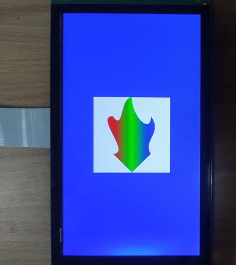

# evkmimxrt1170_04_LinearGradient

Clear the offscreen with white color and draw a linear gradient color object on it. Then blit it to the displayer that has a blue background.

## Hardware Preparation

If using the **MIPI** interface, connect the LCD displayer to **J48** on the MIMXRT1170-EVK board. Connect 5V power to **J43**, set **J38** to **1-2**, and turn on the power switch **SW5**.

## Software Preparation

Now three LCD displayers are supported, which are defined in [**display_support.h**](../common/board/display_support.h):

``` C
#define DEMO_PANEL_RK055AHD091 0 /* 720 * 1280, RK055AHD091-CTG(RK055HDMIPI4M) */
#define DEMO_PANEL_RK055IQH091 1 /* 540 * 960,  RK055IQH091-CTG */
#define DEMO_PANEL_RK055MHD091 2 /* 720 * 1280, RK055MHD091A0-CTG(RK055HDMIPI4MA0) */
```

Use the macro **DEMO_PANEL** to select the LCD panel you are using, the default panel is **RK055AHD091-CTG** configured in the display_support.h:

``` C
#define DEMO_PANEL DEMO_PANEL_RK055AHD091
```

For example, if your LCD panel is **RK055MHD091A0-CTG**, change the macro **DEMO_PANEL** definition as following:

``` C
#define DEMO_PANEL DEMO_PANEL_RK055MHD091
```

The source code is in [**LinearGradient.c**](./source/LinearGradient.c), where the *main* function first configures clocks, pins, etc. **freerots** is deployed in the example. **vglite_task** is created and scheduled to execute VGLite initialization and drawing task.

## VGLite Initialization

Before drawing, several functions are executed to do initialization:

* **`vg_lite_init`** initializes VGLite and configures the tessellation buffer size, which is recommended to be the size of the most commonly rendered path size. 
In this project, it's defined by

    ``` C
    #define OFFSCREEN_BUFFER_WIDTH  400
    #define OFFSCREEN_BUFFER_HEIGHT 400

    error = vg_lite_init(OFFSCREEN_BUFFER_WIDTH, OFFSCREEN_BUFFER_HEIGHT);
    ```

* **`vg_lite_set_command_buffer_size`** sets the GPU command buffer size (optional).

* **`vg_lite_allocate`** allocates the render buffer, whose the input parameter is **vg_lite_buffer_t** structure defining width, height, and color format, etc.

Additional, in this project, **vg_lite_linear_gradient_t** structure defines a linear gradient color. And there are several linear gradient color initialization functions:

* **`vg_lite_init_grad`** initializes the buffer for the linear gradient color. 
* **`vg_lite_set_grad`** sets the gradient's colors and offsets, which are defined by customized arrays of **ramps** and **stops**.
    ``` C
    /* Gradient information. The ramps specify the color information at each one of the stops */
    uint32_t ramps[] = {0xffff0000, 0xff00ff00, 0xff0000ff};

    /* Stops define the offset, where in the line those color ramps will be located. It can go from 0 to 255 */
    uint32_t stops[] = {0, 128, 255};

    vg_lite_set_grad(&grad, 3, ramps, stops); 
    ```

* **`vg_lite_update_grad`** finally updates the *vg_lite_linear_gradient_t* structure to the buffer.

## Drawing Task

The array *pathData* in this project is the same as [*evkmimxrt1170_03_Stroked_CubicCurves*](../evkmimxrt1170_03_Stroked_CubicCurves/), so there is no change in the shape, such as

``` C
static int32_t pathData[] = {
    2, 200, 400,                //Move to (200, 400)
    4, 300, 300,                //Line from (200, 400) to (300, 300)
    8, 254, 228, 365, 190, 300, 100,    //Cubic Curve from (300, 300) to (300, 100) with control point 1 in (254, 228) and control point 2 in (365, 190)
    8, 300, 197, 200, 106, 200, 0,      //Cubic Curve from (300, 100) to (200, 0) with control point 1 in (300, 197) and control point 2 in (200, 106)
    8, 132,   0, 158, 187, 100, 100,    //Cubic Curve from (200, 0) to (100, 100) with control point 1 in (132, 0) and control point 2 in (158, 187)
    8,   0, 100, 200, 300, 100, 300,    //Cubic Curve from (100, 100) to (100, 300) with control point 1 in (0, 100) and control point 2 in (200, 300)
    4, 200, 400,                //Line from (100, 300) to (200, 400)
    0,
};
```

And **vg_lite_path_t** structure describes path data's bounding box, quality, coordinate format, etc., such as

``` C
static vg_lite_path_t path = {
    {0, 0, // left,top
    400, 400}, // right,bottom
    VG_LITE_HIGH, // quality
    VG_LITE_S32, // 
    {0}, // uploaded
    sizeof(pathData), // path length
    pathData, // path data
    1 // path changed
};
```

In drawing task, there are following functions:

* **`vg_lite_clear`** clears the render buffer with a solid color (**ABGR format**). 
In this project, the rendered area is filled with white color by

    ``` C
    vg_lite_clear(&renderTarget, NULL, 0xFFFFFFFF);
    ```

    And the full screen is filled with blue color by

    ``` C
    vg_lite_clear(rt, NULL, 0xFFFF0000);
    ```

* **`vg_lite_identity`** resets the specified transformation matrix, which is uninitialized or previously modified by functions of `vg_lite_translate`, `vg_lite_rotate`, `vg_lite_scale`.

* **`vg_lite_translate`** translates draw result by input coordinates with transformation matrix. 
The path in this project is moved by

    ``` C
    vg_lite_translate(DEMO_BUFFER_WIDTH/2 - OFFSCREEN_BUFFER_WIDTH/2, DEMO_BUFFER_HEIGHT/2 - OFFSCREEN_BUFFER_HEIGHT/2, &matrix);
    ```

* **`vg_lite_blit`** finally copies the source image to the destination window with the specified blend mode and filter mode, determining the showing of objects. 
In this project, **VG_LITE_BLEND_SRC_OVER** blend mode is selected to make source image placed on the background:

    ``` C
    error = vg_lite_blit(rt, &renderTarget, &matrix, VG_LITE_BLEND_SRC_OVER, 0, mainFilter);
    ```

In addition, following functions are used to draw the linear gradient color:

* **`vg_lite_get_grad_matrix`** gets the transformation matrix of the linear gradient, and general transformation functions like `vg_lite_identity`, `vg_lite_translate`, `vg_lite_scale` and `vg_lite_rotate` are suitable for the gradient's matrix.

* **`vg_lite_draw_gradient`** fills a path with the linear gradient color instead of a solid color like `vg_lite_draw`. 
The gradient color is described by the **vg_lite_linear_gradient_t** structure.

    ``` C
    error = vg_lite_draw_gradient(&renderTarget, &path, VG_LITE_FILL_EVEN_ODD, &matrix, &grad, VG_LITE_BLEND_NONE);
    ```

Once an error occurs, cleaning work is needed including the following functions:

* **`vg_lite_clear_grad`** function is called to free up the buffer of the *vg_lite_linear_gradient_t* structure:
    ``` C
    vg_lite_clear_grad(&grad);
    ```

* **`vg_lite_free`** frees the allocated render buffer.

    ``` C
    vg_lite_free(&renderTarget);
    ```

* **`vg_lite_clear_path`** clears path data uploaded to GPU memory.

    ``` C
    vg_lite_clear_path(&path);
    ```

* **`vg_lite_close`** finally frees up the entire memory initialized earlier by the `vg_lite_init` function.

    ``` C
    vg_lite_close();
    ```

## Run

Compile firstly, and use a Micro-USB cable to connect PC to **J86** on MIMXRT1170-EVK board, then download the firmware and run. 

If it's successful, the correct image will show on the displayer:



And FPS information will be sent through UART serial port continuously. The correct UART configuration is

* 115200 baud rate
* 8 data bits
* No parity
* One stop bit
* No flow control

