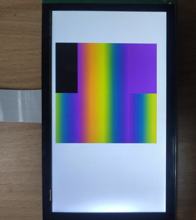

# evkmimxrt1170_06_LinearExtGradient

Draw a big rectangle with the linear gradient color (four small rectangles with different spread modes actually) on the white background.

## Hardware Preparation

If using the **MIPI** interface, connect the LCD displayer to **J48** on the MIMXRT1170-EVK board. Connect 5V power to **J43**, set **J38** to **1-2**, and turn on the power switch **SW5**.

## Software Preparation

Now three LCD displayers are supported, which are defined in [**display_support.h**](../common/board/display_support.h):

``` C
#define DEMO_PANEL_RK055AHD091 0 /* 720 * 1280, RK055AHD091-CTG(RK055HDMIPI4M) */
#define DEMO_PANEL_RK055IQH091 1 /* 540 * 960,  RK055IQH091-CTG */
#define DEMO_PANEL_RK055MHD091 2 /* 720 * 1280, RK055MHD091A0-CTG(RK055HDMIPI4MA0) */
```

Use the macro **DEMO_PANEL** to select the LCD panel you are using, the default panel is **RK055AHD091-CTG** configured in the display_support.h:

``` C
#define DEMO_PANEL DEMO_PANEL_RK055AHD091
```

For example, if your LCD panel is **RK055MHD091A0-CTG**, change the macro **DEMO_PANEL** definition as following:

``` C
#define DEMO_PANEL DEMO_PANEL_RK055MHD091
```

The source code is in [**LinearExtGradient.c**](./source/LinearExtGradient.c), where the *main* function first configures clocks, pins, etc. **freerots** is deployed in the example. **vglite_task** is created and scheduled to execute VGLite initialization and drawing task.

## VGLite Initialization

Before drawing, several functions are executed to do initialization:
* **`vg_lite_init`** initializes VGLite and configures the tessellation buffer size, which is recommended to be the size of the most commonly rendered path size. In this project, it's defined by

    ``` C
    #define OFFSCREEN_BUFFER_WIDTH  400
    #define OFFSCREEN_BUFFER_HEIGHT 400

    error = vg_lite_init(OFFSCREEN_BUFFER_WIDTH, OFFSCREEN_BUFFER_HEIGHT);
    ```

* **`vg_lite_set_command_buffer_size`** sets the GPU command buffer size (optional).

## Drawing Task

The array *pathData* in this project is used to draw four small rectangles, which will be filled by the linear gradient color:

``` C
static int16_t path_data[] = {
    2, 0, 0,
    4, 160, 0,
    4, 160, 160,
    4, 0, 160,
    0,
};
```
And **vg_lite_path_t** structure describes path data's bounding box, quality, coordinate format, etc., such as

``` C
static vg_lite_path_t path = {
    { 0,   0,
      160, 160 },
    VG_LITE_HIGH,
    VG_LITE_S16,
    {0},
    sizeof(path_data),
    path_data,
    1
};
```

Four spread modes are defined by **vg_lite_radial_gradient_spreadmode_t** structure, including

* **VG_LITE_RADIAL_GRADIENT_SPREAD_FILL**: Fill the outside of the gradient area with **black** color.
* **VG_LITE_RADIAL_GRADIENT_SPREAD_PAD**: Fill the outside area with **the closest stop** color.
* **VG_LITE_RADIAL_GRADIENT_SPREAD_REPEAT**: Fill the outside area with **repeated** gradient.
* **VG_LITE_RADIAL_GRADIENT_SPREAD_REFLECT**: Fill the outside area with **reflected** gradient.

In this project, four rectangles with four spread modes are rendered by a customized `render_linear_gradient` function in the following *for* loop:

``` C
vg_lite_radial_gradient_spreadmode_t spreadmode[] = {
    VG_LITE_RADIAL_GRADIENT_SPREAD_FILL,
    VG_LITE_RADIAL_GRADIENT_SPREAD_PAD,
    VG_LITE_RADIAL_GRADIENT_SPREAD_REPEAT,
    VG_LITE_RADIAL_GRADIENT_SPREAD_REFLECT,
};

for(int i = 0; i < sizeof(spreadmode)/sizeof(spreadmode[0]); i++) {
    error = render_linear_gradient(rt, i);
}
```

In the customized `render_linear_gradient` function, three structures are needed when generating the linear gradient color:

* **vg_lite_linear_gradient_ext_t** structure is the definition of the linear gradient which will fill a path.

* **vg_lite_color_ramp_t** structure define colors (**RGBA** format) and stops of linear gradient, whose all parameters are in the range of **[0, 1]**, which will be mapped to [0, 255]. 

    In this project, five colors and stops are defined in the array **vgColorRamp**. For example, in the first member of this array (*0.0f, 0.4f, 0.0f, 0.6f, 1.0f*), the first number (*0.0f*) means the offset, next three numbers (*0.4f, 0.0f, 0.6f*) correspond r, g, b channels, and the last number (*1.0f*) is the alpha value.

    ``` C
    static vg_lite_color_ramp_t vgColorRamp[] =
    {
        {
            0.0f,
            0.4f, 0.0f, 0.6f, 1.0f
        },
        {
            0.25f,
            0.9f, 0.5f, 0.1f, 1.0f
        },
        {
            0.5f,
            0.8f, 0.8f, 0.0f, 1.0f
        },
        {
            0.75f,
            0.0f, 0.3f, 0.5f, 1.0f
        },
        {
            1.00f,
            0.4f, 0.0f, 0.6f, 1.0f
        }
    };
    ```

* **vg_lite_linear_gradient_parameter_t** structure defines the radial direction for a linear gradient, including four parameters. The first two numbers are the **X and Y coordinates** of the **origin point**, and last two numbers are the **X and Y coordinates** of the **end point**.

    In this project, the coordinates of origin and end point are set by:

    ``` C
    vg_lite_linear_gradient_parameter_t radialGradient = {160.0f, 100.0f, 480.0f, 100.0f};
    ```

The following functions are used to draw the linear gradient color:

* **`vg_lite_set_linear_grad`** sets the parameters of the linear gradient described by above structures. In this project, this function applies four spread modes to four rectangles：

    ``` C
    error = vg_lite_set_linear_grad(&grad, 5, vgColorRamp, radialGradient, spreadmode[fcount], 1);
    ```

* **`vg_lite_update_linear_grad`** updates the values defined by *vg_lite_linear_gradient_ext_t* structure.

    ``` C
    error = vg_lite_update_linear_grad(&grad);
    ```

* **`vg_lite_get_linear_grad_matrix`** gets the transformation matrix of the linear gradient, and general transformation functions like `vg_lite_identity`, `vg_lite_translate`, `vg_lite_scale` and `vg_lite_rotate` are suitable for this matrix.

    ``` C
    matGrad = vg_lite_get_linear_grad_matrix(&grad);
    ```

    This gradient transformation matrix needs to be initialized, otherwise the linear gradient will not be displayed:

    ``` C
    vg_lite_identity(matGrad);
    ```

* **`vg_lite_draw_linear_gradient`** is used to fill a path with a linear gradient, defined by the *vg_lite_linear_gradient_ext_t* structure.

    ``` C
    error = vg_lite_draw_linear_gradient(fb, &path, VG_LITE_FILL_EVEN_ODD, &matPath, &grad, 0, VG_LITE_BLEND_NONE, VG_LITE_FILTER_LINEAR);
    ```

* **`vg_lite_clear_linear_grad`** clears the values defined by *vg_lite_linear_gradient_ext_t* structure and frees up the buffer.

    ``` C
    error = vg_lite_clear_linear_grad(&grad);
    ```

And some generic functions are used:

* **`vg_lite_clear`** clears the render buffer with a solid color (**ABGR format**). 
In this project, the full screen is filled with white color by 
    ``` C
    vg_lite_clear(rt, NULL, 0xFFFFFFFF);
    ```

* **`vg_lite_identity`** resets the specified transformation matrix, which is uninitialized or previously modified by functions of `vg_lite_translate`, `vg_lite_rotate`, `vg_lite_scale`.

* **`vg_lite_translate`** translates draw result by input coordinates with transformation matrix. 

* **`vg_lite_scale`** scales the transformation matrix in both horizontal and vertical directions.

In this project, four rectangles are scaled, and placed next to each other by 

``` C
vg_lite_identity(&matPath);
vg_lite_scale(2.0f, 2.0f, &matPath);

vg_lite_translate(10.0f + x * 160, 100.0f + y * 160, &matPath);
```

Once an error occurs, cleaning work is needed including the following function:

* **`vg_lite_close`** finally frees up the entire memory initialized earlier by the `vg_lite_init` function.
    ``` C
    vg_lite_close();
    ```

## Run

Compile firstly, and use a Micro-USB cable to connect PC to **J86** on MIMXRT1170-EVK board, then download the firmware and run. 

If it's successful, the correct image will show on the displayer:



And FPS information will be sent through UART serial port continuously. The correct UART configuration is

* 115200 baud rate
* 8 data bits
* No parity
* One stop bit
* No flow control