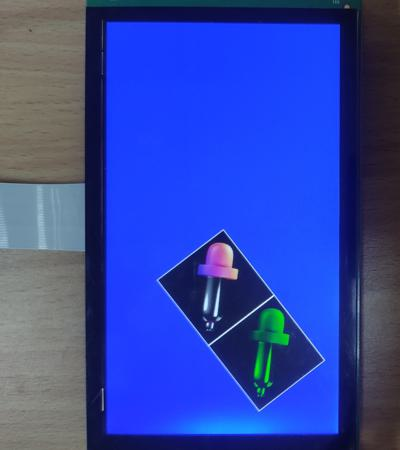
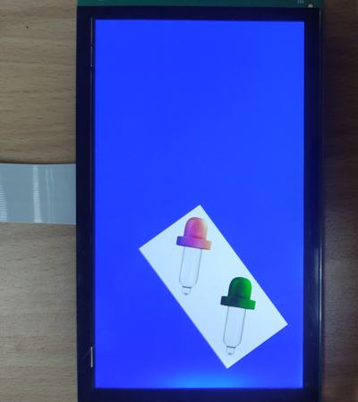
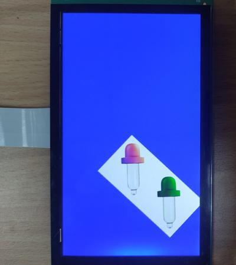
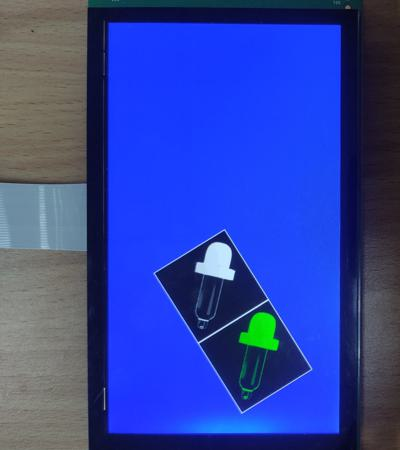
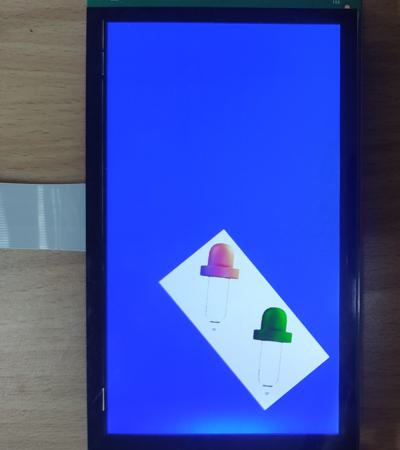
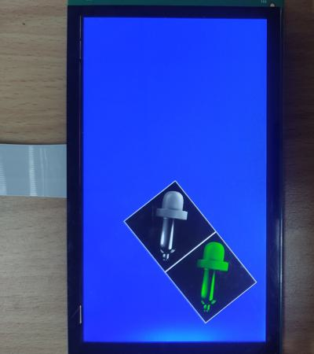
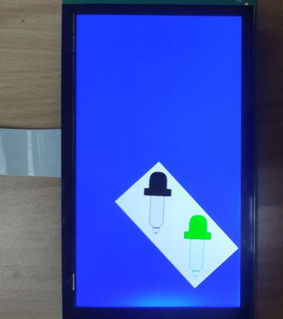
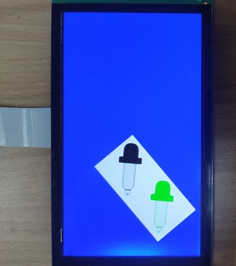
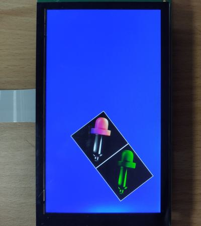

# evkmimxrt1170_08_BlitColor

Clear the offscreen with white color and blit two dropper images with two image modes on it. Then blit this offscreen to the displayer that has a blue background. The offscreen keeps rotating around, and eight color formats are supported, each corresponding to a macro.

## Hardware Preparation

If using the **MIPI** interface, connect the LCD displayer to **J48** on the MIMXRT1170-EVK board. Connect 5V power to **J43**, set **J38** to **1-2**, and turn on the power switch **SW5**.

## Software Preparation

Now three LCD displayers are supported, which are defined in [**display_support.h**](../common/board/display_support.h):

``` C
#define DEMO_PANEL_RK055AHD091 0 /* 720 * 1280, RK055AHD091-CTG(RK055HDMIPI4M) */
#define DEMO_PANEL_RK055IQH091 1 /* 540 * 960,  RK055IQH091-CTG */
#define DEMO_PANEL_RK055MHD091 2 /* 720 * 1280, RK055MHD091A0-CTG(RK055HDMIPI4MA0) */
```

Use the macro **DEMO_PANEL** to select the LCD panel you are using, the default panel is **RK055AHD091-CTG** configured in the display_support.h:

``` C
#define DEMO_PANEL DEMO_PANEL_RK055AHD091
```

For example, if your LCD panel is **RK055MHD091A0-CTG**, change the macro **DEMO_PANEL** definition as following:

``` C
#define DEMO_PANEL DEMO_PANEL_RK055MHD091
```

The source code is in [**BlitColor.c**](./source/BlitColor.c), where the *main* function first configures clocks, pins, etc. **freerots** is deployed in the example. **vglite_task** is created and scheduled to execute VGLite initialization and drawing task.

And there are **./source/DropperMinixxxx.c** and **./source/DropperMinixxxx.h** files, which store image data with eight formats including *BGR565*, *BGRA4444*, *BGRA8888*, *BGRA2222* (not supported by RT 1160 and RT1170, RT500 is suitable), *BGRA5551*, *L8*, *A4*, *A8* and *YUYV*.

## VGLite Initialization

Configure the macro **DROPPER_FORMAT** to select a color format, the default format is **BGRA8888** in this project:

``` C
#define DROPPER565       0
#define DROPPER4444      1
#define DROPPER8888      2
#if defined(CPU_MIMXRT595SFFOC_cm33) // only RT500 supports this format, RT1170 and RT1160 are not suitable
#define DROPPER2222      3
#endif
#define DROPPER5551      4
#define DROPPERL8        5
#define DROPPERA4        6
#define DROPPERA8        7
#define DROPPERYUYV      8
#define DROPPER_FORMAT   DROPPER8888

#if(DROPPER_FORMAT==DROPPER565)
#include "DropperMini565.h"
#elif (DROPPER_FORMAT==DROPPER4444)
#include "DropperMini4444.h"
#elif (DROPPER_FORMAT==DROPPER8888)
#include "DropperMini8888.h"
#elif defined(DROPPER2222) && (DROPPER_FORMAT==DROPPER2222)
#include "DropperMini2222.h"
#elif (DROPPER_FORMAT==DROPPER5551)
#include "DropperMini5551.h"
#elif (DROPPER_FORMAT==DROPPERL8)
#include "DropperMiniL8.h"
#elif (DROPPER_FORMAT==DROPPERA4)
#include "DropperMiniA4.h"
#elif (DROPPER_FORMAT==DROPPERA8)
#include "DropperMiniA8.h"
#else
#include "DropperMiniYUYV.h"
#endif
```

Before drawing, several functions are executed to do initialization:

* **`vg_lite_init`** initializes VGLite and configures the tessellation buffer size, which is recommended to be the size of the most commonly rendered path size. 
In this project, it's defined by

    ``` C
    #define OFFSCREEN_BUFFER_WIDTH    520
    #define OFFSCREEN_BUFFER_HEIGHT   260

    error = vg_lite_init(OFFSCREEN_BUFFER_WIDTH, OFFSCREEN_BUFFER_HEIGHT);
    ```

* **`vg_lite_set_command_buffer_size`** sets the GPU command buffer size (optional).

* **`vg_lite_allocate`** allocates the render buffer, whose the input parameter is **vg_lite_buffer_t** structure defining width, height, and color format, etc.

In this project, the *renderTarget* is the offscreen buffer, another buffer *dropper* is created to load the image data from *./source/DropperMinixxxx.c*, and define parameters like width, height, format, and memory, etc. The key code is shown below:

``` C
/* Load the image data to a vg_lite_buffer */
dropper.width  = IMG_WIDTH;
dropper.height = IMG_HEIGHT;
dropper.stride = IMG_STRIDE;
dropper.format = IMG_FORMAT;

error = vg_lite_allocate(&dropper);

/* Copy the data to the buffer */
uint8_t * buffer_memory = (uint8_t *) dropper.memory;

#if(DROPPER_FORMAT==DROPPER565)
    uint8_t  *pdata = (uint8_t *) BGR565_Data;
#elif (DROPPER_FORMAT==DROPPER4444)
    uint8_t  *pdata = (uint8_t *) BGRA4444_Data;
#elif (DROPPER_FORMAT==DROPPER8888)
    uint8_t  *pdata = (uint8_t *) BGRA8888_Data;
#elif defined(DROPPER2222) && (DROPPER_FORMAT==DROPPER2222)
    uint8_t  *pdata = (uint8_t *) BGRA2222_Data;
#elif (DROPPER_FORMAT==DROPPER5551)
    uint8_t  *pdata = (uint8_t *) BGRA5551_Data;
#elif (DROPPER_FORMAT==DROPPERL8)
    uint8_t  *pdata = (uint8_t *) L8_Data;
#elif (DROPPER_FORMAT==DROPPERA4)
    uint8_t  *pdata = (uint8_t *) A4_Data;
#elif (DROPPER_FORMAT==DROPPERA8)
    uint8_t  *pdata = (uint8_t *) A8_Data;
#else
    uint8_t  *pdata = (uint8_t *) YUYV_Data;
#endif

for (j = 0; j < dropper.height; j++) 
{
    memcpy(buffer_memory, pdata, dropper.stride);
    buffer_memory += dropper.stride;
    pdata += dropper.stride;
}
```

## Drawing Task

There is no path to be drawn, so the array *pathData* and *vg_lite_path_t* structure is not used in this project.

In drawing task, there are following functions:

* **`vg_lite_clear`** clears the render buffer with a solid color (**ABGR format**). 
In this project, the rendered area is filled with white color by

    ``` C
    vg_lite_clear(&renderTarget, NULL, 0xFFFFFFFF);
    ```

    And the full screen is filled with blue color by

    ``` C
    vg_lite_clear(rt, NULL, 0xFFFF0000);
    ```

* **`vg_lite_identity`** resets the specified transformation matrix, which is uninitialized or previously modified by functions of `vg_lite_translate`, `vg_lite_rotate`, `vg_lite_scale`.

* **`vg_lite_translate`** translates draw result by input coordinates with transformation matrix.

* **`vg_lite_rotate`** rotates draw result by input angle with transformation matrix.

* **`vg_lite_blit`** finally copies the source image to the destination window with the specified blend mode and filter mode, determining the showing of objects. The image blit mode is defined by **vg_lite_buffer_image_mode_t** enumeration, including:

    * **VG_LITE_NORMAL_IMAGE_MODE**: draw the source image with blend mode.
    * **VG_LITE_NONE_IMAGE_MODE**: ignore the source image.
    * **VG_LITE_MULTIPLY_IMAGE_MODE**: multiply the source image with paint color.

In this project, `vg_lite_identity` and `vg_lite_translate` are used to place two droppers and the offscreen buffer. *rAngle* variable is incremented by 0.3 degree each time, and then **`vg_lite_rotate`** function applies this angle to the transformation matrix, achieving the rotating part. 

The *`vg_lite_blit`* is called to blit two droppers and the offscreen buffer with different image mode. The first dropper uses **VG_LITE_NORMAL_IMAGE_MODE** (except A4 and A8 formats that are invisible in this mode), showing its original color. The second dropper uses **VG_LITE_MULTIPLY_IMAGE_MODE**, which multiplies the source image color with green color (*0xFF00FF00*), making it green.

The key code is shown below:

``` C
    vg_lite_clear(&renderTarget, NULL, 0xFFF0F0F0);
   
    /* Define the transformation matrix that will be applied */
    vg_lite_identity(&matrix);
    vg_lite_translate(2, 2, &matrix);

    /* Blit the buffer to the render target */
#if (DROPPER_FORMAT==DROPPERA4 || DROPPER_FORMAT==DROPPERA8)
    dropper.image_mode = VG_LITE_MULTIPLY_IMAGE_MODE;
#else
    dropper.image_mode = VG_LITE_NORMAL_IMAGE_MODE;
#endif
    error = vg_lite_blit(&renderTarget, &dropper, &matrix, VG_LITE_BLEND_SRC_OVER, 0xFF000000, mainFilter);

    /* Blit the buffer, and multiply it by a color */
    vg_lite_translate(260, 0, &matrix);
    dropper.image_mode = VG_LITE_MULTIPLY_IMAGE_MODE;
    error = vg_lite_blit(&renderTarget, &dropper, &matrix, VG_LITE_BLEND_SRC_OVER, 0xFF00FF00, mainFilter);

    /* Clear whole screen with solid blue */
    vg_lite_clear(rt, NULL, 0xFFFF0000);
    vg_lite_identity(&matrix);
    dropper.image_mode = VG_LITE_NORMAL_IMAGE_MODE;
    vg_lite_translate(DEMO_PANEL_WIDTH/2.0, DEMO_PANEL_HEIGHT/2.0, &matrix);
    vg_lite_rotate(rAngle, &matrix);
    error = vg_lite_blit(rt, &renderTarget, &matrix, VG_LITE_BLEND_SRC_OVER, 0, mainFilter);

    rAngle += 0.3;
```

Compare different color formats by selecting macros, the lower bit width of channels degrades the image quality obviously (especially from *VG_LITE_BGRA8888* to *VG_LITE_BGRA2222*). When *VG_LITE_BGRA5551* is selected, the translucency of dropper glass disappears, as the alpha value is only 0 (lucent) or 1 (opaque). If *VG_LITE_BGR565* is applied, the black background appears since the alpha channel is discarded. The *VG_LITE_L8* only displays the grayscale of the source image. And *VG_LITE_A4* and *VG_LITE_A8* only show the alpha information of the source image (invisible without RGB channels), which need the *VG_LITE_MULTIPLY_IMAGE_MODE* to make it painted.

Once an error occurs, cleaning work is needed including the following functions:

* **`vg_lite_free`** frees the allocated render buffer.

    ``` C
    vg_lite_free(&renderTarget);
    vg_lite_free(&dropper);
    ```

* **`vg_lite_close`** finally frees up the entire memory initialized earlier by the `vg_lite_init` function.

    ``` C
    vg_lite_close();
    ```

## Run

Compile firstly, and use a Micro-USB cable to connect PC to **J86** on MIMXRT1170-EVK board, then download the firmware and run. 

If it's successful, the correct image will show on the displayer: (when the macro **DROPPER_FORMAT** is *DROPPER565*, *DROPPER4444*, *DROPPER8888*, *DROPPER2222*, *DROPPER5551*, *DROPPERL8*, *DROPPERA4*, *DROPPERA8*, and *DROPPERYUYV* respectively)

<table border="1" align="center">
<tr>
<td>
    
</td>
<td>
    
</td>
<td>
    
</td>
</tr>

<tr>
<td>
    DROPPER565
</td>
<td>
    DROPPER4444
</td>
<td>
    DROPPER8888
</td>
</tr>

<tr>
<td>
    
</td>
<td>
    
</td>
<td>
    
</td>
</tr>

<tr>
<td>
    DROPPER2222 (incorrect display on rt1170)
</td>
<td>
    DROPPER5551
</td>
<td>
    DROPPERL8
</td>
</tr>

<tr>
<td>
    
</td>
<td>
    
</td>
<td>
    
</td>
</tr>

<tr>
<td>
    DROPPERA4
</td>
<td>
    DROPPERA8
</td>
<td>
    DROPPERYUYV
</td>
</tr>

</table>

And FPS information will be sent through UART serial port continuously. The correct UART configuration is

* 115200 baud rate
* 8 data bits
* No parity
* One stop bit
* No flow control