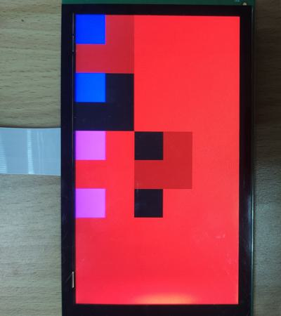

# evkmimxrt1170_09_AlphaBehavior

Fill the upper left quarter of a offscreen buffer with blue, and the other three quarters are colorless and transparent. Then blit this offscreen to the displayer eight times next to each other, using different blend modes. The displayer has a red background.

## Hardware Preparation

If using the **MIPI** interface, connect the LCD displayer to **J48** on the MIMXRT1170-EVK board. Connect 5V power to **J43**, set **J38** to **1-2**, and turn on the power switch **SW5**.

## Software Preparation

Now three LCD displayers are supported, which are defined in [**display_support.h**](../common/board/display_support.h):

``` C
#define DEMO_PANEL_RK055AHD091 0 /* 720 * 1280, RK055AHD091-CTG(RK055HDMIPI4M) */
#define DEMO_PANEL_RK055IQH091 1 /* 540 * 960,  RK055IQH091-CTG */
#define DEMO_PANEL_RK055MHD091 2 /* 720 * 1280, RK055MHD091A0-CTG(RK055HDMIPI4MA0) */
```

Use the macro **DEMO_PANEL** to select the LCD panel you are using, the default panel is **RK055AHD091-CTG** configured in the display_support.h:

``` C
#define DEMO_PANEL DEMO_PANEL_RK055AHD091
```

For example, if your LCD panel is **RK055MHD091A0-CTG**, change the macro **DEMO_PANEL** definition as following:

``` C
#define DEMO_PANEL DEMO_PANEL_RK055MHD091
```

The source code is in [**AlphaBehavior.c**](./source/AlphaBehavior.c), where the *main* function first configures clocks, pins, etc. **freerots** is deployed in the example. **vglite_task** is created and scheduled to execute VGLite initialization and drawing task.

## VGLite Initialization

Before drawing, several functions are executed to do initialization:

* **`vg_lite_init`** initializes VGLite and configures the tessellation buffer size, which is recommended to be the size of the most commonly rendered path size. In this project, it's defined by

    ``` C
    error = vg_lite_init(64, 64);
    ```

* **`vg_lite_set_command_buffer_size`** sets the GPU command buffer size (optional).

* **`vg_lite_allocate`** allocates the render buffer, whose input parameter is **vg_lite_buffer_t** structure defining width, height, and color format, etc.

    ``` C
    bufferToBlit.width = TEST_RASTER_BUF_WIDTH;
    bufferToBlit.height = TEST_RASTER_BUF_HEIGHT;
    bufferToBlit.format = VG_LITE_BGRA8888;
    error = vg_lite_allocate(&bufferToBlit);
    ```

In this project, the **vg_lite_buffer_t** structure **bufferToBlit** is created, where the upper left quarter is blue, and the other areas are colorless and translucent. Its memory is set by the following key code:

    ``` C
    #define TEST_RASTER_BUF_WIDTH     (256)
    #define TEST_RASTER_BUF_HEIGHT    (256)
    #define TEST_SMALL_SIZE           (128)

    buffer_memory = (uint32_t *) bufferToBlit.memory;

    /* Alpha value is 0x7F, color value is 0 */
    for (i = 0; i < TEST_RASTER_BUF_WIDTH * TEST_RASTER_BUF_HEIGHT; i++) 
        buffer_memory[i] = 0x5F000000;

    /* Blue color */
    for (i = 0; i < TEST_SMALL_SIZE; i++)
        for (j = 0; j < TEST_SMALL_SIZE; j++)
            buffer_memory[i * TEST_RASTER_BUF_WIDTH + j] = 0xFF0000FF;
    ```

## Drawing Task

There is no path to be drawn, so the array *pathData* and *vg_lite_path_t* structure is not used in this project.

In drawing task, there are following functions:

* **`vg_lite_clear`** clears the render buffer with a solid color (**ABGR format**). 

In this project, the full screen is filled with red color by 
    ``` C
    vg_lite_clear(rt, NULL, 0xFF0000FF);
    ```
* **`vg_lite_identity`** resets the specified transformation matrix, which is uninitialized or previously modified by functions of `vg_lite_translate`, `vg_lite_rotate`, `vg_lite_scale`.

* **`vg_lite_translate`** translates draw result by input coordinates with transformation matrix.

* **`vg_lite_blit`** finally blits the source (src) image to the destination (dst) image, using different blend modes defined by **vg_lite_blend_t** enumeration: (S and D mean the source and destination color channels, and Sa and Da mean the source and destination alpha channels)

* **VG_LITE_BLEND_SRC_OVER**: Shows the src over the dst, and dst can only be shown in the area where Sa is not 1, and the formula is **`S + (1 - Sa) * D`**.

* **VG_LITE_BLEND_DST_OVER**: Contrary to the *VG_LITE_BLEND_SRC_OVER* mode, this mode shows dst over the src, so src can only be seen in the area where Da is not 1, and the formula is **`(1 – Da) * S + D`**.

* **VG_LITE_BLEND_SRC_IN**: Shows the src where src and dst overlap, and Da is also applied to the src image, whose formula is **`Da * S`**.

* **VG_LITE_BLEND_DST_IN**: Contrary to the *VG_LITE_BLEND_SRC_OVER* mode, this shows the dst where src and dst overlap, and Sa is also applied to the dst image, whose formula is **`Sa * D`**.

* **VG_LITE_BLEND_SCREEN**: Shows both the src and the dst images, and the result color is at least as light as either of S or D, whose effect is similar to projecting multiple photographic slides simultaneously onto a single screen. The formula is **`1 - [(1 - S) * (1 - S)] = S + D – S * D`**.

* **VG_LITE_BLEND_MULTIPLY**: Shows both the src and the dst images, and the src image is multiplied by the dst image, which then replaces the area where src and dst overlap. The formula is **`S * (1 – Da) + D * (1 – Sa) + S * D`**.

* **VG_LITE_BLEND_ADDITIVE**: Simply adds images of src and dst, and the formula is **`S + D`**.

* **VG_LITE_BLEND_SUBTRACT**: Contrary to the *VG_LITE_BLEND_ADDITIVE* mode, subtracts src from dst, with the formula of **`D - S`**.

**<u>Click [here](https://www.w3.org/TR/compositing-1/)</u>** for more details on the blend modes.

In this project, `vg_lite_translate` and `vg_lite_blit` are called many times for bliting the render buffer to the displayer eight times next to each other, using different blend modes. The key code is:

``` C
vg_lite_clear(rt, NULL, 0xFF0000FF);

/* Define the transformation matrix that will be applied */
vg_lite_identity(&matrix);

/*Blit with VG_LITE_BLEND_SRC_OVER blending */
error = vg_lite_blit(rt, &bufferToBlit, &matrix, VG_LITE_BLEND_SRC_OVER, 0, mainFilter);

vg_lite_translate(TEST_RASTER_BUF_WIDTH, 0, &matrix);
/*Blit with VG_LITE_BLEND_DST_OVER blending */
error = vg_lite_blit(rt, &bufferToBlit, &matrix, VG_LITE_BLEND_DST_OVER, 0, mainFilter);

vg_lite_translate(-TEST_RASTER_BUF_WIDTH, TEST_RASTER_BUF_HEIGHT, &matrix);
/*Blit with VG_LITE_BLEND_SRC_IN blending */
error = vg_lite_blit(rt, &bufferToBlit, &matrix, VG_LITE_BLEND_SRC_IN, 0, mainFilter);

vg_lite_translate(TEST_RASTER_BUF_WIDTH, 0, &matrix);
/*Blit with VG_LITE_BLEND_DST_IN blending */
error = vg_lite_blit(rt, &bufferToBlit, &matrix, VG_LITE_BLEND_DST_IN, 0, mainFilter);

vg_lite_translate(-TEST_RASTER_BUF_WIDTH, TEST_RASTER_BUF_HEIGHT, &matrix);
/*Blit with VG_LITE_BLEND_SCREEN blending */
error = vg_lite_blit(rt, &bufferToBlit, &matrix, VG_LITE_BLEND_SCREEN, 0, mainFilter);

vg_lite_translate(TEST_RASTER_BUF_WIDTH, 0, &matrix);
/*Blit with VG_LITE_BLEND_MULTIPLY blending */
error = vg_lite_blit(rt, &bufferToBlit, &matrix, VG_LITE_BLEND_MULTIPLY, 0, mainFilter);

vg_lite_translate(-TEST_RASTER_BUF_WIDTH, TEST_RASTER_BUF_HEIGHT, &matrix);
/*Blit with VG_LITE_BLEND_ADDITIVE blending */
error = vg_lite_blit(rt, &bufferToBlit, &matrix, VG_LITE_BLEND_ADDITIVE, 0, mainFilter);

vg_lite_translate(TEST_RASTER_BUF_WIDTH, 0, &matrix);
/*Blit with VG_LITE_BLEND_SUBTRACT blending */
error = vg_lite_blit(rt, &bufferToBlit, &matrix, VG_LITE_BLEND_SUBTRACT, 0, mainFilter);
```

Once an error occurs, cleaning work is needed including the following functions:

* **`vg_lite_free`** frees the allocated render buffer.

    ``` C
    vg_lite_free(&renderTarget);
    ```

* **`vg_lite_close`** finally frees up the entire memory initialized earlier by the `vg_lite_init` function.

    ``` C
    vg_lite_close();
    ```

## Run

Compile firstly, and use a Micro-USB cable to connect PC to **J86** on MIMXRT1170-EVK board, then download the firmware and run. 

If it's successful, the correct image will show on the displayer:



And FPS information will be sent through UART serial port continuously. The correct UART configuration is

* 115200 baud rate
* 8 data bits
* No parity
* One stop bit
* No flow control