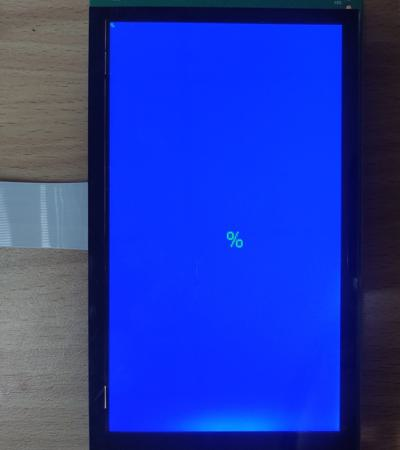

# evkmimxrt1170_10_Glyphs

Stores the character '%' to the offscreen, and blit it twice to the displayer that has a blue background. The first time blit a small green one is in the upper left corner, and the second time blit a large green character in the center.

## Hardware Preparation

If using the **MIPI** interface, connect the LCD displayer to **J48** on the MIMXRT1170-EVK board. Connect 5V power to **J43**, set **J38** to **1-2**, and turn on the power switch **SW5**.

## Software Preparation

Now three LCD displayers are supported, which are defined in [**display_support.h**](../common/board/display_support.h):

``` C
#define DEMO_PANEL_RK055AHD091 0 /* 720 * 1280, RK055AHD091-CTG(RK055HDMIPI4M) */
#define DEMO_PANEL_RK055IQH091 1 /* 540 * 960,  RK055IQH091-CTG */
#define DEMO_PANEL_RK055MHD091 2 /* 720 * 1280, RK055MHD091A0-CTG(RK055HDMIPI4MA0) */
```

Use the macro **DEMO_PANEL** to select the LCD panel you are using, the default panel is **RK055AHD091-CTG** configured in the display_support.h:

``` C
#define DEMO_PANEL DEMO_PANEL_RK055AHD091
```

For example, if your LCD panel is **RK055MHD091A0-CTG**, change the macro **DEMO_PANEL** definition as following:

``` C
#define DEMO_PANEL DEMO_PANEL_RK055MHD091
```

The source code is in [**Glyphs.c**](./source/Glyphs.c), where the *main* function first configures clocks, pins, etc. **freerots** is deployed in the example. **vglite_task** is created and scheduled to execute VGLite initialization and drawing task.

## VGLite Initialization

Before drawing, several functions are executed to do initialization:

* **`vg_lite_init`** initializes VGLite and configures the tessellation buffer size, which is recommended to be the size of the most commonly rendered path size. 
In this project, it's defined by

    ``` C
    #define OFFSCREEN_BUFFER_WIDTH  400
    #define OFFSCREEN_BUFFER_HEIGHT 400

    error = vg_lite_init(OFFSCREEN_BUFFER_WIDTH, OFFSCREEN_BUFFER_HEIGHT);
    ```

* **`vg_lite_set_command_buffer_size`** sets the GPU command buffer size (optional).

* **`vg_lite_allocate`** allocates the render buffer, whose the input parameter is **vg_lite_buffer_t** structure defining width, height, and color format, etc.

In this project, the **vg_lite_buffer_t** structure **bufferToBlit** is defined, whose color format is **VG_LITE_A8**, which means 8-bit alpha format without RGB values: 

``` C
bufferToBlit.width = 16;
bufferToBlit.height = 16;
bufferToBlit.format = VG_LITE_A8;
```

And the data to be blit is stored in the array **a2_glyph** in the 2-bit alpha format, i.e., each byte includes four pixels. But VGLite doesn't support this format (only **4-bit** or **8-bit** alpha formats are supported), so a format conversion function is necessary, which is shown below:

``` C
//16x16 A2 '%' glyph
const uint8_t a2_glyph[] = 
{
  0x00, 0x00, 0x00, 0x00, 0x00, 0x00, 0x00, 0x00,
  0x00, 0x00, 0x00, 0x00, 0xF4, 0x07, 0x0D, 0x00,
  0x1C, 0x0D, 0x06, 0x00, 0x0C, 0x0C, 0x03, 0x00,
  0x0C, 0x8C, 0x01, 0x00, 0x1C, 0xCD, 0x00, 0x00,
  0xF4, 0xA7, 0x00, 0x00, 0x00, 0x30, 0xFD, 0x01,
  0x00, 0x28, 0x47, 0x03, 0x00, 0x0C, 0x03, 0x03,
  0x00, 0x09, 0x03, 0x03, 0x00, 0x07, 0x47, 0x03,
  0x40, 0x02, 0xFD, 0x01, 0x00, 0x00, 0x00, 0x00
};

for( i = 0; i < 64; i++ )
{
    data[i*4 + 0] = a2_to_a8_lut[( a2_glyph[i] >> 0 ) & 0x3];
    data[i*4 + 1] = a2_to_a8_lut[( a2_glyph[i] >> 2 ) & 0x3];
    data[i*4 + 2] = a2_to_a8_lut[( a2_glyph[i] >> 4 ) & 0x3];
    data[i*4 + 3] = a2_to_a8_lut[( a2_glyph[i] >> 6 ) & 0x3];
}
```

Then this *data* array is copied to the memory buffer **bufferToBlit**, such as

``` C
buffer_memory = (uint8_t *) bufferToBlit.memory;
for ( j = 0; j < 16*16; j++)
{
    buffer_memory[j] = data[j];
}
```

## Drawing Task

Since there is no path to be drawn, the array *pathData* and *vg_lite_path_t* structure is not used in this project.

In drawing task, there are following functions:

* **`vg_lite_clear`** clears the render buffer with a solid color (**ABGR format**). 
In this project, full screen is filled with blue color by

    ``` C
    vg_lite_clear(rt, NULL, 0xFFFF0000);
    ```

* **`vg_lite_identity`** resets the specified transformation matrix, which is uninitialized or previously modified by functions of `vg_lite_translate`, `vg_lite_rotate`, `vg_lite_scale`.

* **`vg_lite_translate`** translates draw result by input coordinates with transformation matrix.
The second character in this project is moved by
    ``` C
    vg_lite_translate(DEMO_BUFFER_WIDTH/2, DEMO_BUFFER_HEIGHT/2, &matrix);
    ```

* **`vg_lite_scale`** scales the transformation matrix in both horizontal and vertical directions.
In this project, the second character is scaled up by
    ``` C
    vg_lite_scale(4.0, 4.0, &matrix);
    ```

* **`vg_lite_blit`** finally copies the source image to the destination window with the specified blend mode and filter mode, determining the showing of objects.
When using *VG_LITE_NORMAL_IMAGE_MODE*, the *VG_LITE_A8* format is invisiable as it has no RGB color values. But the image mode **VG_LITE_MULTIPLY_IMAGE_MODE** is able to paint it with the specified color in this project:

    ``` C
    bufferToBlit.image_mode = VG_LITE_MULTIPLY_IMAGE_MODE;
    vg_lite_blit(rt, &bufferToBlit, &matrix, VG_LITE_BLEND_SRC_OVER, 0xFF00FF00, mainFilter);
    ```

## Run

Compile firstly, and use a Micro-USB cable to connect PC to **J86** on MIMXRT1170-EVK board, then download the firmware and run. 

If it's successful, the correct image will show on the displayer:



And FPS information will be sent through UART serial port continuously. The correct UART configuration is

* 115200 baud rate
* 8 data bits
* No parity
* One stop bit
* No flow control