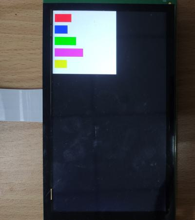

# evkmimxrt1170_11_FreeSizeBuffers

Clear an offscreen with white color and draw five buffers with different sizes and colors, then blit it to the center of display that has a black background.

## Hardware Preparation

If using the **MIPI** interface, connect the LCD displayer to **J48** on the MIMXRT1170-EVK board. Connect 5V power to **J43**, set **J38** to **1-2**, and turn on the power switch **SW5**.

## Software Preparation

Now three LCD displayers are supported, which are defined in [**display_support.h**](../common/board/display_support.h):

``` C
#define DEMO_PANEL_RK055AHD091 0 /* 720 * 1280, RK055AHD091-CTG(RK055HDMIPI4M) */
#define DEMO_PANEL_RK055IQH091 1 /* 540 * 960,  RK055IQH091-CTG */
#define DEMO_PANEL_RK055MHD091 2 /* 720 * 1280, RK055MHD091A0-CTG(RK055HDMIPI4MA0) */
```

Use the macro **DEMO_PANEL** to select the LCD panel you are using, the default panel is **RK055AHD091-CTG** configured in the display_support.h:

``` C
#define DEMO_PANEL DEMO_PANEL_RK055AHD091
```

For example, if your LCD panel is **RK055MHD091A0-CTG**, change the macro **DEMO_PANEL** definition as following:

``` C
#define DEMO_PANEL DEMO_PANEL_RK055MHD091
```

The source code is in [**FreeSizeBuffers.c**](./source/FreeSizeBuffers.c), where the *main* function first configures clocks, pins, etc. **freerots** is deployed in the example. **vglite_task** is created and scheduled to execute VGLite initialization and drawing task.

## VGLite Initialization

Before drawing, several functions are executed to do initialization:

* **`vg_lite_init`** initializes VGLite and configures the tessellation buffer size, which is recommended to be the size of the most commonly rendered path size. 
In this project, it's defined by

    ``` C
    #define OFFSCREEN_BUFFER_WIDTH  400
    #define OFFSCREEN_BUFFER_HEIGHT 400

    error = vg_lite_init(OFFSCREEN_BUFFER_WIDTH, OFFSCREEN_BUFFER_HEIGHT);
    ```

* **`vg_lite_set_command_buffer_size`** sets the GPU command buffer size (optional).

* **`vg_lite_allocate`** allocates the render buffer, whose the input parameter is **vg_lite_buffer_t** structure defining width, height, and color format, etc.

In this project, the **vg_lite_buffer_t** structure array **buffers[5]** is defined, and corresponding arrays, such as **strangeBufferValues[5]**, **offsetValues[5]**, **clearColorValues[5]**, are created to define the size, Y coordinate, and color of five members of **buffers[5]**:

``` C
vg_lite_buffer_t buffers[5];

unsigned int strangeBufferValues[5] = {107, 83, 137, 181, 79};

unsigned int offsetValues[5];

unsigned int clearColorValues[5] = {0xFF0000FF, 0xFFFF0000, 0xFF00FF00, 0xFFFF00FF, 0xFF00FFFF};

offsetValues[0] = 20;
offsetValues[1] = offsetValues[0] + 73;
offsetValues[2] = offsetValues[1] + 73;
offsetValues[3] = offsetValues[2] + 73;
offsetValues[4] = offsetValues[3] + 73;
```

And five width values and five color values are applied to the corresponding buffer in the following code:

``` C
for(i = 0; i < 5; i++)
{
    buffers[i].width = strangeBufferValues[i];
    buffers[i].height = 53;
    buffers[i].format = VG_LITE_RGBA8888;

    error = vg_lite_allocate(&buffers[i]);
}
```

## Drawing Task

Since there is no path to be drawn, the array *pathData* and *vg_lite_path_t* structure is not used in this project.
In drawing task, there are following functions:

* **`vg_lite_clear`** clears the render buffer with a solid color (**ABGR format**). 
In this project, the rendered area is filled with white color by

    ``` C
    vg_lite_clear(&renderTarget, NULL, 0xFFFFFFFF);
    ```

    And five buffers are cleared with specified colors, shown in the following key code: 

    ``` C
    for(i = 0; i < 5; i++)
    {
        vg_lite_clear(&buffers[i], NULL, clearColorValues[i]);
    }
    ```

* **`vg_lite_identity`** resets the specified transformation matrix, which is uninitialized or previously modified by functions of `vg_lite_translate`, `vg_lite_rotate`, `vg_lite_scale`.

* **`vg_lite_translate`** translates draw result by input coordinates with transformation matrix. 

* **`vg_lite_blit`** finally copies the source image to the destination window with the specified blend mode and filter mode, determining the showing of objects. 

In this project, a *for* loop function is used to blit five buffers to different positions:

``` C
for(i = 0; i < 5; i++)
{
    vg_lite_identity(&matrix);
    vg_lite_translate(10, offsetValues[i], &matrix);
    error = vg_lite_blit(&renderTarget, &buffers[i], &matrix, VG_LITE_BLEND_SRC_OVER, 0, mainFilter);
}
```

Once an error occurs, cleaning work is needed including the following functions:

* **`vg_lite_free`** frees the allocated render buffers.

    ``` C
    for(i = 0; i < 5; i++)
    {
        vg_lite_free(&buffers[i]);
    }
    vg_lite_free(&renderTarget);
    ```

* **`vg_lite_close`** finally frees up the entire memory initialized earlier by the `vg_lite_init` function.

    ``` C
    vg_lite_close();
    ```

## Run

Compile firstly, and use a Micro-USB cable to connect PC to **J86** on MIMXRT1170-EVK board, then download the firmware and run. 

If it's successful, the correct image will show on the displayer:



And FPS information will be sent through UART serial port continuously. The correct UART configuration is

* 115200 baud rate
* 8 data bits
* No parity
* One stop bit
* No flow control