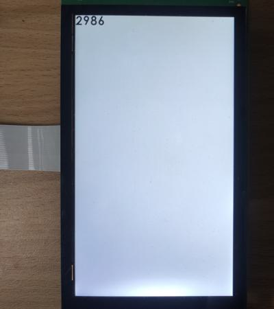

# evkmimxrt1170_12_BlitRect

Create an offscreen storing ten numbers, then blit its four rectangles to the upper left corner of display that has a white background, to show four black numbers: "2986".

## Hardware Preparation

If using the **MIPI** interface, connect the LCD displayer to **J48** on the MIMXRT1170-EVK board. Connect 5V power to **J43**, set **J38** to **1-2**, and turn on the power switch **SW5**.

## Software Preparation

Now three LCD displayers are supported, which are defined in [**display_support.h**](../common/board/display_support.h):

``` C
#define DEMO_PANEL_RK055AHD091 0 /* 720 * 1280, RK055AHD091-CTG(RK055HDMIPI4M) */
#define DEMO_PANEL_RK055IQH091 1 /* 540 * 960,  RK055IQH091-CTG */
#define DEMO_PANEL_RK055MHD091 2 /* 720 * 1280, RK055MHD091A0-CTG(RK055HDMIPI4MA0) */
```

Use the macro **DEMO_PANEL** to select the LCD panel you are using, the default panel is **RK055AHD091-CTG** configured in the display_support.h:

``` C
#define DEMO_PANEL DEMO_PANEL_RK055AHD091
```

For example, if your LCD panel is **RK055MHD091A0-CTG**, change the macro **DEMO_PANEL** definition as following:

``` C
#define DEMO_PANEL DEMO_PANEL_RK055MHD091
```

The source code is in [**BlitRect.c**](./source/BlitRect.c), where the *main* function first configures clocks, pins, etc. **freerots** is deployed in the example. **vglite_task** is created and scheduled to execute VGLite initialization and drawing task.

In addition, files of [**Numbas.h**](./source/Numbas.h) and [**Numbas.c**](./source/Numbas.c) are used to store numbers of 0-9, whose visual image is [**CenturyNumbas.png**](./source/CenturyNumbas.png) (the background is transparent).

## VGLite Initialization

Before drawing, several functions are executed to do initialization:

* **`vg_lite_init`** initializes VGLite and configures the tessellation buffer size, which is recommended to be the size of the most commonly rendered path size. 
In this project, it's defined by

    ``` C
    vg_lite_init(64, 64);
    ```

* **`vg_lite_set_command_buffer_size`** sets the GPU command buffer size (optional).

* **`vg_lite_allocate`** allocates the render buffer, whose the input parameter is **vg_lite_buffer_t** structure defining width, height, and color format, etc.

In the initialization of this project, a customized `load_glyphatlas` function configures the **vg_lite_buffer_t** structure **glyphBuffer**, and copis line by line from the image data array **Numbas_Bitmap0** to this buffer. This process is achieved by the following key code, where *glyphBuffer.stride = the byte number per pixel of glyphBuffer.format * glyphBuffer.width*

``` C
glyphBuffer.width = 160;
glyphBuffer.height = 92;
glyphBuffer.format = VG_LITE_RGBA8888;
error = vg_lite_allocate(&glyphBuffer);

uint8_t * buffer_memory = (uint8_t *) glyphBuffer.memory;
uint8_t  *pdata = (uint8_t *) Numbas_Bitmap0;

for (int j = 0; j < glyphBuffer.height; j++) 
{
    memcpy(buffer_memory, pdata, glyphBuffer.stride);
    buffer_memory += glyphBuffer.stride;
    pdata += glyphBuffer.stride;
}
```

## Drawing Task

Since there is no path to be drawn, the array *pathData* and *vg_lite_path_t* structure is not used in this project.

In drawing task, there are following functions:

* **`vg_lite_clear`** clears the render buffer with a solid color (**ABGR format**). 

    In this project, the full screen is filled with white color by

    ``` C
    vg_lite_clear(rt, NULL, 0xFFFFFFFF);
    ```

* **`vg_lite_identity`** resets the specified transformation matrix, which is uninitialized or previously modified by functions of `vg_lite_translate`, `vg_lite_rotate`, `vg_lite_scale`.

* **`vg_lite_translate`** translates draw result by input coordinates with transformation matrix.

* **`vg_lite_blit_rect`** blits the specified rectangle area of the buffer instead of a whole area like `vg_lite_blit_rect`. 

In this project, the rectangles of four numbers are blit by calling `vg_lite_blit_rect` function four times, as the input array *rect* includes the coordinate and size of specified rectangle: *rect*[0]/[1]/[2]/[3] are x, y,
width, and height of the source rectangle respectively. The key code is:

``` C
vg_lite_identity(&matrix);
rect[0] = 32; rect[1] = 0; rect[2] = 32; rect[3] = 46;
error = vg_lite_blit_rect(rt, &glyphBuffer, rect, &matrix, VG_LITE_BLEND_SRC_OVER, 0, mainFilter);

vg_lite_translate(34,0,&matrix);
rect[0] = 96; rect[1] = 46; rect[2] = 32; rect[3] = 46;
error = vg_lite_blit_rect(rt, &glyphBuffer, rect, &matrix, VG_LITE_BLEND_SRC_OVER, 0, mainFilter);

vg_lite_translate(34,0,&matrix);
rect[0] = 64; rect[1] = 46; rect[2] = 32; rect[3] = 46;
error = vg_lite_blit_rect(rt, &glyphBuffer, rect, &matrix, VG_LITE_BLEND_SRC_OVER, 0, mainFilter);

vg_lite_translate(34,0,&matrix);
rect[0] = 0; rect[1] = 46; rect[2] = 32; rect[3] = 46;
error = vg_lite_blit_rect(rt, &glyphBuffer, rect, &matrix, VG_LITE_BLEND_SRC_OVER, 0, mainFilter);
```

Once an error occurs, cleaning work is needed including the following function:

* **`vg_lite_close`** finally frees up the entire memory initialized earlier by the `vg_lite_init` function.

    ``` C
    vg_lite_close();
    ```

## Run

Compile firstly, and use a Micro-USB cable to connect PC to **J86** on MIMXRT1170-EVK board, then download the firmware and run. 

If it's successful, the correct image will show on the displayer:



And FPS information will be sent through UART serial port continuously. The correct UART configuration is

* 115200 baud rate
* 8 data bits
* No parity
* One stop bit
* No flow control