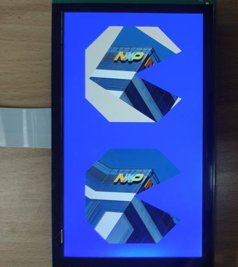

# evkmimxrt1170_13_PatternFill

Clear an offscreen with blue color and draw two convex polygons to it, then blit it to the display. Two convex polygons include two images with different image pattern modes.

## Hardware Preparation

If using the **MIPI** interface, connect the LCD displayer to **J48** on the MIMXRT1170-EVK board. Connect 5V power to **J43**, set **J38** to **1-2**, and turn on the power switch **SW5**.

## Software Preparation

Now three LCD displayers are supported, which are defined in [**display_support.h**](../common/board/display_support.h):

``` C
#define DEMO_PANEL_RK055AHD091 0 /* 720 * 1280, RK055AHD091-CTG(RK055HDMIPI4M) */
#define DEMO_PANEL_RK055IQH091 1 /* 540 * 960,  RK055IQH091-CTG */
#define DEMO_PANEL_RK055MHD091 2 /* 720 * 1280, RK055MHD091A0-CTG(RK055HDMIPI4MA0) */
```

Use the macro **DEMO_PANEL** to select the LCD panel you are using, the default panel is **RK055AHD091-CTG** configured in the display_support.h:

``` C
#define DEMO_PANEL DEMO_PANEL_RK055AHD091
```

For example, if your LCD panel is **RK055MHD091A0-CTG**, change the macro **DEMO_PANEL** definition as following:

``` C
#define DEMO_PANEL DEMO_PANEL_RK055MHD091
```

The source code is in [**PatternFill.c**](./source/PatternFill.c), where the *main* function first configures clocks, pins, etc. **freerots** is deployed in the example. **vglite_task** is created and scheduled to execute VGLite initialization and drawing task.

And there is [**picture.h**](./source/picture.h) files, which stores image data and information of width, height, stride, and color format:

``` C
AT_NONCACHEABLE_SECTION_ALIGN_INIT(static unsigned char picture_raw[], 64) = {
......
}

#define IMG_WIDTH  440
#define IMG_HEIGHT 360
#define IMG_STRIDE 880
#define IMG_FORMAT VG_LITE_RGB565
```

## VGLite Initialization

Before drawing, several functions are executed to do initialization:

* **`vg_lite_init`** initializes VGLite and configures the tessellation buffer size, which is recommended to be the size of the most commonly rendered path size. 
In this project, it's defined by

    ``` C
    error = vg_lite_init(256, 256);
    ```

* **`vg_lite_set_command_buffer_size`** sets the GPU command buffer size (optional).

* **`vg_lite_allocate`** allocates the render buffer, whose the input parameter is **vg_lite_buffer_t** structure defining width, height, and color format, etc.

In the initialization of this project, a customized `vg_lite_set_image` function configures the **vg_lite_buffer_t** structure *image* and sets the memory buffer. The key code is shown below:

``` C
static vg_lite_buffer_t image;

static int vg_lite_set_image(vg_lite_buffer_t *buffer, uint8_t *imm_array, int32_t width, int32_t height, int32_t stride, vg_lite_buffer_format_t format)
{
    /* Get width, height, stride and format info */
    buffer->width = width;
    buffer->height = height;

    buffer->stride = stride;
    buffer->format = format;
    /* 'Copy' image data in the buffer */
    buffer->handle = NULL;
    buffer->memory = imm_array;
    buffer->address = (uint32_t)imm_array;

    return 0;
}

vg_lite_set_image(&image, (uint8_t *) &picture_raw, IMG_WIDTH, IMG_HEIGHT, IMG_STRIDE, IMG_FORMAT)
```

## Drawing Task

The path drawing opcodes (1st column) and arguments (other columns) are defined in the array **pathData**, such as

``` C
static int8_t path_data[] = {
    2, -5, -10, // moveto   -5,-10
    4, 5, -10,  // lineto    5,-10
    4, 10, -5,  // lineto   10, -5
    4, 0, 0,    // lineto    0,  0
    4, 10, 5,   // lineto   10,  5
    4, 5, 10,   // lineto    5, 10
    4, -5, 10,  // lineto   -5, 10
    4, -10, 5,  // lineto  -10,  5
    4, -10, -5, // lineto  -10, -5
    0,          // end
};
```

And **vg_lite_path_t** structure describes path data's bounding box, quality, coordinate format, etc., such as

``` C
static vg_lite_path_t path = {
    {-10, -10,          // left,top
      10,  10},         // right,bottom
    VG_LITE_HIGH,       // quality
    VG_LITE_S8,         // -128 to 127 coordinate range
    {0},                // uploaded
    sizeof(path_data),  // path length
    path_data,          // path data
    1
};
```

In drawing task, there are following functions:

* **`vg_lite_clear`** clears the render buffer with a solid color (**ABGR format**). 
In this project, the rendered area is filled with blue color by

    ``` C
    vg_lite_clear(&renderTarget, NULL, 0xFFFF0000);
    ```

* **`vg_lite_identity`** resets the specified transformation matrix, which is uninitialized or previously modified by functions of `vg_lite_translate`, `vg_lite_rotate`, `vg_lite_scale`.

* **`vg_lite_translate`** translates draw result by input coordinates with transformation matrix. 

* **`vg_lite_blit`** finally copies the source image to the destination window with the specified blend mode and filter mode, determining the showing of objects. 

* **`vg_lite_rotate`** rotates draw result by input angle with transformation matrix.

* **`vg_lite_scale`** scales the transformation matrix in both horizontal and vertical directions.

* **`vg_lite_draw_pattern`** fills the path with an image pattern mode, which replaces the `vg_lite_draw` function. There are two image pattern modes below, defined by the **vg_lite_pattern_mode** enumeration:

    * **VG_LITE_PATTERN_COLOR**: fill the area outside the image with a specified color.

    * **VG_LITE_PATTERN_PAD**: expand the color of the image border to fill outside area.

In this project, `vg_lite_identity`, `vg_lite_translate`, `vg_lite_rotate`, `vg_lite_scale` are called to configure the transformation matrix. And **`vg_lite_draw_pattern`** is called to draw path with two image pattern modes, at the first time fills the area outside the image with the *0xffaabbcc* color, and the second time fills the outside area by expanding the color of the image border. The key code is shown below:

``` C
// Build a 33 degree rotation matrix from the center of the buffer.
vg_lite_identity(&matrix);
vg_lite_translate(DEFAULT_WIDTH / 2, DEFAULT_HEIGHT / 4, &matrix);
vg_lite_rotate(33.0f, &matrix);
vg_lite_translate(DEFAULT_WIDTH / -4.0f, DEFAULT_HEIGHT / -6.0f, &matrix);

vg_lite_identity(&matPath);
vg_lite_translate(DEFAULT_WIDTH / 2.0f, DEFAULT_HEIGHT / 4.0f, &matPath);
vg_lite_scale(25, 25, &matPath);

// Fill the path using an image with the VG_LITE_PATTERN_COLOR mode.
error =
    vg_lite_draw_pattern(&renderTarget, &path, VG_LITE_FILL_EVEN_ODD, &matPath, &image, &matrix, VG_LITE_BLEND_NONE, VG_LITE_PATTERN_COLOR, 0xffaabbcc, mainFilter);

// Build a 33 degree rotation matrix from the center of the buffer.
vg_lite_identity(&matrix);
vg_lite_translate(DEFAULT_WIDTH / 2.0f, (3 * DEFAULT_HEIGHT) / 4, &matrix);
vg_lite_rotate(33.0f, &matrix);
vg_lite_translate(DEFAULT_WIDTH / -4.0f, DEFAULT_HEIGHT / -6.0f, &matrix);

vg_lite_identity(&matPath);
vg_lite_translate(DEFAULT_WIDTH / 2.0f, (3 * DEFAULT_HEIGHT) / 4, &matPath);
vg_lite_scale(25, 25, &matPath);

// Fill the path using an image with the VG_LITE_PATTERN_PAD mode.
vg_lite_draw_pattern(&renderTarget, &path, VG_LITE_FILL_EVEN_ODD, &matPath, &image, &matrix, VG_LITE_BLEND_NONE, VG_LITE_PATTERN_PAD, 0xffaabbcc, mainFilter);
```

Once an error occurs, cleaning work is needed including the following functions:

* **`vg_lite_free`** frees the allocated render buffer.

    ``` C
    vg_lite_free(&renderTarget);
    ```

* **`vg_lite_clear_path`** clears path data uploaded to GPU memory.

    ``` C
    vg_lite_clear_path(&path);
    ```

* **`vg_lite_close`** finally frees up the entire memory initialized earlier by the `vg_lite_init` function.

    ``` C
    vg_lite_close();
    ```

## Run

Compile firstly, and use a Micro-USB cable to connect PC to **J86** on MIMXRT1170-EVK board, then download the firmware and run. 

If it's successful, the correct image will show on the displayer:



And FPS information will be sent through UART serial port continuously. The correct UART configuration is

* 115200 baud rate
* 8 data bits
* No parity
* One stop bit
* No flow control