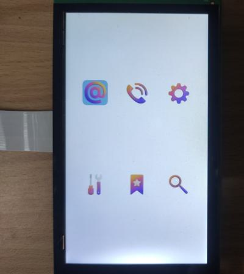

# evkmimxrt1170_14_UI

Create six buffers storing six icons then blit six icons to the display that has a white background. Six icons are alternately highlighted by blue rounded rectangles.

## Hardware Preparation

If using the **MIPI** interface, connect the LCD displayer to **J48** on the MIMXRT1170-EVK board. Connect 5V power to **J43**, set **J38** to **1-2**, and turn on the power switch **SW5**.

## Software Preparation

Now three LCD displayers are supported, which are defined in [**display_support.h**](../common/board/display_support.h):

``` C
#define DEMO_PANEL_RK055AHD091 0 /* 720 * 1280, RK055AHD091-CTG(RK055HDMIPI4M) */
#define DEMO_PANEL_RK055IQH091 1 /* 540 * 960,  RK055IQH091-CTG */
#define DEMO_PANEL_RK055MHD091 2 /* 720 * 1280, RK055MHD091A0-CTG(RK055HDMIPI4MA0) */
```

Use the macro **DEMO_PANEL** to select the LCD panel you are using, the default panel is **RK055AHD091-CTG** configured in the display_support.h:

``` C
#define DEMO_PANEL DEMO_PANEL_RK055AHD091
```

For example, if your LCD panel is **RK055MHD091A0-CTG**, change the macro **DEMO_PANEL** definition as following:

``` C
#define DEMO_PANEL DEMO_PANEL_RK055MHD091
```

The source code is in [**Ui.c**](./source/Ui.c), where the *main* function first configures clocks, pins, etc. **freerots** is deployed in the example. **vglite_task** is created and scheduled to execute VGLite initialization and drawing task.

In addition, the [**/icons/**](./source/icons/) folder includes six header files storing icons’ image data and information of width, height, stride, and color format.

## VGLite Initialization

Before drawing, several functions are executed to do initialization:

* **`vg_lite_init`** initializes VGLite and configures the tessellation buffer size, which is recommended to be the size of the most commonly rendered path size. 
In this project, it's defined by

    ``` C
    error = vg_lite_init(32, 32);
    ```

* **`vg_lite_set_command_buffer_size`** sets the GPU command buffer size (optional).

In the initialization of this project, a customized `loadImages` function loads images to the static **vg_lite_buffer_t** structure array **icons[6]** by calling customized `vg_lite_set_image` function. The key code is shown below:

``` C
#define ICON_COUNT             6
static vg_lite_buffer_t        icons[ICON_COUNT];

err = vg_lite_set_image(&icons[0], &img1_data[0], IMG1_WIDTH, IMG1_HEIGHT, IMG1_STRIDE, IMG1_FORMAT);
err = vg_lite_set_image(&icons[1], &img2_data[0], IMG2_WIDTH, IMG2_HEIGHT, IMG2_STRIDE, IMG2_FORMAT);
...
err = vg_lite_set_image(&icons[5], &img6_data[0], IMG6_WIDTH, IMG6_HEIGHT, IMG6_STRIDE, IMG6_FORMAT);
```

The `vg_lite_set_image` function is used to configures the **vg_lite_buffer_t** structure array *icons* and sets the memory buffers. The key code is shown below:

``` C
static int vg_lite_set_image(vg_lite_buffer_t *buffer, uint8_t *imm_array, int32_t width, int32_t height, int32_t stride, vg_lite_buffer_format_t format)
{
    /* Get width, height, stride and format info */
    buffer->width = width;
    buffer->height = height;

    buffer->stride = stride;
    buffer->format = format;
    /* 'Copy' image data in the buffer */
    buffer->handle = NULL;
    buffer->memory = imm_array;
    buffer->address = (uint32_t)imm_array;

    return 0;
}
```

A timer supported by *freertos* is created and started, whose the period is defined by the macro **HIGHLIGHT_PERIOD_MS** (one second by default). 
This timer's callback function increments the *highlight_index* variable, to determine which icon is hightlighted at the current period. The key code is shown below:

``` C
#define HIGHLIGHT_PERIOD_MS 1000

static void timer_callback(void* parameter)
{
    highlight_index += 1;
}

timer_handle = xTimerCreate("Timer", pdMS_TO_TICKS(HIGHLIGHT_PERIOD_MS), pdTRUE, (void *)NULL, timer_callback);
```

## Drawing Task

The path drawing opcodes (1st column) and arguments (other columns) are defined in the array **pathData** to highlight one icon by the rounded rectangle, such as

``` C
#define HIGHLIGHT_SIZE      10
#define HIGHLIGHT_RAD       2

static int8_t path_data[] = {
    2, HIGHLIGHT_RAD,  0,

    4, HIGHLIGHT_SIZE - HIGHLIGHT_RAD, 0,
    6, HIGHLIGHT_SIZE, 0, HIGHLIGHT_SIZE, HIGHLIGHT_RAD,

    4, HIGHLIGHT_SIZE, HIGHLIGHT_SIZE - HIGHLIGHT_RAD,
    6, HIGHLIGHT_SIZE, HIGHLIGHT_SIZE, HIGHLIGHT_SIZE - HIGHLIGHT_RAD, HIGHLIGHT_SIZE,

    4, HIGHLIGHT_RAD, HIGHLIGHT_SIZE,
    6, 0, HIGHLIGHT_SIZE, 0, HIGHLIGHT_SIZE - HIGHLIGHT_RAD,

    4, 0, HIGHLIGHT_RAD,
    6, 0, 0, HIGHLIGHT_RAD, 0,
    0

};
```

And **vg_lite_path_t** structure describes path data's bounding box, quality, coordinate format, etc., such as

``` C
static vg_lite_path_t path = {
    {-10, -10, 10, 10},     /* left,top, right,bottom */
    VG_LITE_HIGH,           /* quality */
    VG_LITE_S8,             /* -128 to 127 coordinate range */
    {0},                    /* uploaded */
    sizeof(path_data),      /* path length */
    path_data,              /* path data */
    1
};
```

In drawing task, there are following functions:

* **`vg_lite_clear`** clears the render buffer with a solid color (**ABGR format**). 
In this project, the frame buffer is filled with white color by
    ``` C
    fb = VGLITE_GetRenderTarget(&window);

    error = vg_lite_clear(fb, NULL, 0xFFFFFFFF);
    ```
* **`vg_lite_identity`** resets the specified transformation matrix, which is uninitialized or previously modified by functions of `vg_lite_translate`, `vg_lite_rotate`, `vg_lite_scale`.

* **`vg_lite_translate`** translates draw result by input coordinates with transformation matrix. 

* **`vg_lite_scale`** scales the transformation matrix in both horizontal and vertical directions.

* **`vg_lite_blit`** finally copies the source image to the destination window with the specified blend mode and filter mode, determining the showing of objects. The **vg_lite_filter_t** enumeration defines the filter mode, which includes three values:

    * **VG_LITE_FILTER_POINT**: fetch only the nearest image pixel.
    * **VG_LITE_FILTER_LINEAR**: use linear interpolation along horizontal line.
    * **VG_LITE_FILTER_BI_LINEAR**: use a 2*2 box around the image pixel and perform an interpolation.

In this project, the incremented variable *highlight_index* selects icon to be highlighted. And the blue rounded rectangle is drawn at the position of the selected icon, with *path_data* and *path* involved. In two *for* loops, six icons are blit after being scaled and translated. And the **VG_LITE_FILTER_BI_LINEAR** is used for interpolation, the key code of icon bliting is shown below:

``` C
/* Draw the 6 icons (3 x 2) */
gap_x = (fb_width - icon_size * 3) / 4;
gap_y = (fb_height - icon_size * 2) / 3;
icon_id = 0;

y = gap_y;
for (i = 0; i < 2; i++) {
    x = gap_x;
    for (j = 0; j < 3; j++) {
        icon_pos[icon_id][0] = x;
        icon_pos[icon_id][1] = y;
        x += icon_size + gap_x;
        
        /* Setup the matrix. */
        vg_lite_identity(&icon_matrix);
        vg_lite_translate(icon_pos[icon_id][0], icon_pos[icon_id][1], &icon_matrix);
        vg_lite_scale((float)icon_size / icons[icon_id].width, (float)icon_size / icons[icon_id].height, &icon_matrix);

        error = vg_lite_blit(fb, &icons[icon_id], &icon_matrix, VG_LITE_BLEND_SRC_OVER, 0, filter);

        icon_id++;
    }
    y += icon_size + gap_y;
}
```

Once an error occurs, cleaning work is needed including the following functions:

* **`vg_lite_free`** frees the allocated render buffer.

    ``` C
    vg_lite_free(fb);
    ```

* **`vg_lite_clear_path`** clears path data uploaded to GPU memory.

    ``` C
    vg_lite_clear_path(&path);
    ```

* **`vg_lite_close`** finally frees up the entire memory initialized earlier by the `vg_lite_init` function.

    ``` C
    vg_lite_close();
    ```

## Run

Compile firstly, and use a Micro-USB cable to connect PC to **J86** on MIMXRT1170-EVK board, then download the firmware and run. 

If it's successful, the correct image will show on the displayer:



And FPS information will be sent through UART serial port continuously. The correct UART configuration is

* 115200 baud rate
* 8 data bits
* No parity
* One stop bit
* No flow control