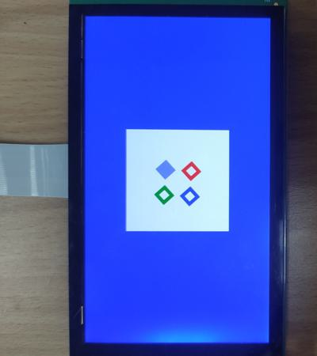

# evkmimxrt1170_16_EVOExtra

Clear an offscreen with white color and draw four rotating rectangles to it, then blit it to the center of display that has a blue background.

## Hardware Preparation

If using the **MIPI** interface, connect the LCD displayer to **J48** on the MIMXRT1170-EVK board. Connect 5V power to **J43**, set **J38** to **1-2**, and turn on the power switch **SW5**.

## Software Preparation

Now three LCD displayers are supported, which are defined in [**display_support.h**](../common/board/display_support.h):

``` C
#define DEMO_PANEL_RK055AHD091 0 /* 720 * 1280, RK055AHD091-CTG(RK055HDMIPI4M) */
#define DEMO_PANEL_RK055IQH091 1 /* 540 * 960,  RK055IQH091-CTG */
#define DEMO_PANEL_RK055MHD091 2 /* 720 * 1280, RK055MHD091A0-CTG(RK055HDMIPI4MA0) */
```

Use the macro **DEMO_PANEL** to select the LCD panel you are using, the default panel is **RK055AHD091-CTG** configured in the display_support.h:

``` C
#define DEMO_PANEL DEMO_PANEL_RK055AHD091
```

For example, if your LCD panel is **RK055MHD091A0-CTG**, change the macro **DEMO_PANEL** definition as following:

``` C
#define DEMO_PANEL DEMO_PANEL_RK055MHD091
```

The source code is in [**EVOExtra.c**](./source/EVOExtra.c), where the *main* function first configures clocks, pins, etc. **freerots** is deployed in the example. **vglite_task** is created and scheduled to execute VGLite initialization and drawing task.

In addition, the [**FillRule.h**](./source/FillRule.h) file includes an array storing the path data:
``` C
unsigned char fill_rule_evo[] = {
    ......
    ......
    ......
};
unsigned int fill_rule_evo_len = 1152;

```
## VGLite Initialization

Similar to [*evkmimxrt1170_15_EVOLoading*](../evkmimxrt1170_15_EVOLoading),
this project also uses **Elementary** to load paths, so there are some elementary functions in the initialization compared to previous VGLite projects.

* **`ElmInitialize`** initializes and configures the tessellation buffer size, similar to the `vg_lite_init` function.

* **`ElmWrapBuffer`** maps the **vg_lite_buffer_t** structure to the elementary buffer **ElmBuffer**, make elementary rendered to the screen directly.

* **`ElmCreateObjectFromData`** loads the data with specified type defined by **ELM_OBJECT_TYPE** enumeration, and return a **ElmHandle** structure for subsequent transformation and drawing. 
The **ELM_OBJECT_TYPE** enumeration includes six values:

    * **ELM_OBJECT_TYPE_EVO**: elementary vector object, representing a path object.
    * **ELM_OBJECT_TYPE_EGO**: elementary group object, containing multiple path objects.
    * **ELM_OBJECT_TYPE_EBO**: elementary bitmap object, representing image data.
    * **ELM_OBJECT_TYPE_BUF**: rendering buffer object, created by application.
    * **ELM_OBJECT_TYPE_FONT**: elementary font object, representing character data.
    * **ELM_OBJECT_TYPE_TEXT**: elementary text object, representing text data.
And some generic VGLite functions are also used to do initialization:
* **`vg_lite_set_command_buffer_size`** sets the GPU command buffer size (optional).

* **`vg_lite_allocate`** allocates the render buffer, whose the input parameter is **vg_lite_buffer_t** structure defining width, height, and color format, etc.

The key code of initialization is shown below:

``` C
    status = ElmInitialize(OFFSCREEN_BUFFER_WIDTH, OFFSCREEN_BUFFER_HEIGHT);

    /* Set GPU command buffer size for this drawing task. */
    error = vg_lite_set_command_buffer_size(VGLITE_COMMAND_BUFFER_SZ);

    /* Allocate an offscreen buffer where the path will be rendered */
    renderTarget.width = OFFSCREEN_BUFFER_WIDTH;
    renderTarget.height = OFFSCREEN_BUFFER_HEIGHT;
    renderTarget.format = VG_LITE_RGBA8888;
    error = vg_lite_allocate(&renderTarget);

    /* Map the vg_lite_buffer to an elementary buffer where rendering is to be done */
    elmRenderTarget = ElmWrapBuffer(renderTarget.width, renderTarget.height, renderTarget.stride, 
                                    renderTarget.memory, renderTarget.address, ELM_BUFFER_FORMAT_RGBA8888);
  

    /* Load the EVO file from the buffer */
    handle = ElmCreateObjectFromData(ELM_OBJECT_TYPE_EVO, (void *)fill_rule_evo, fill_rule_evo_len);
```

## Drawing Task

Since the elementary path data is stored in [*FillRule.h*](./source/FillRule.h), the array *pathData* and *vg_lite_path_t* structure is not used in this project.

As **Elementary** is used, there are also elementary functions replacing some VGLite functions:

* **`ElmReset`** restores the specified transformation prosperity or prosperities for the provided **ElmHandle** elementary object, such as
    ``` C
    ElmReset(handle, ELM_PROP_TRANSFER_BIT);
    ```

    The input mask property is defined by **ELM_EVO_PROP_BIT** enumeration, including
    * **ELM_PROP_ROTATE_BIT**: rotate bit of evo/ego/ebo transformation property.
    * **ELM_PROP_TRANSFER_BIT**: transfer bit of evo/ego/ebo transformation property.
    * **ELM_PROP_SCALE_BIT**: scale bit of evo/ego/ebo transformation property.
    * **ELM_PROP_BLEND_BIT**: blending bit of evo/ebo rendering property.
    * **ELM_PROP_QUALITY_BIT**: quality bit of evo/ebo rendering property.
    * **ELM_PROP_FILL_BIT**: fill rule bit of evo rendering property.
    * **ELM_PROP_COLOR_BIT**: fill color bit of evo rendering property.
    * **ELM_PROP_PAINT_BIT**: paint type bit of evo.
    * **ELM_PROP_ALL_BIT**: all transformation property bits of evo.

* **`ElmTransfer`** puts an evo/ebo/ego away at different directions. The setting will be accumulated until `ElmReset` is called.

* **`ElmRotate`** sets an evo/ebo/ego object rotated with specified angle. The setting will be accumulated until `ElmReset` is called.
In this project, the four rectangles rotate by 0.5 degrees each time with the following code:

    ``` C
    /* Below functions change the object matrix */
    ElmTransfer(handle, 200, 200);
    ElmRotate(handle, angle);
    ElmTransfer(handle, -200, -200);
    angle+=0.5;
    ```

* **`ElmDraw`** renders the object to the elementary buffer, taking all current setting of the elementary object, such as 

    ``` C
    ElmDraw(elmRenderTarget, handle);
    ```

And this project's drawing part also includes VGLite functions like `vg_lite_clear`, `vg_lite_identity`, `vg_lite_translate`, `vg_lite_blit`, etc:

* **`vg_lite_clear`** clears the render buffer with a solid color (**ABGR format**). 

* **`vg_lite_identity`** resets the specified transformation matrix, which is uninitialized or previously modified by functions of `vg_lite_translate`, `vg_lite_rotate`, `vg_lite_scale`.

* **`vg_lite_translate`** translates draw result by input coordinates with transformation matrix. 

* **`vg_lite_blit`** finally copies the source image to the destination window with the specified blend mode and filter mode, determining the showing of objects.

Once an error occurs, cleaning work is needed including the following functions:

* **`ElmDestroyObject`** releases all internal elementary resource of the input object.
    ``` C
    ElmDestroyObject(handle);
    ```

* **`vg_lite_free`** frees the allocated render buffer.

    ``` C
    vg_lite_free(&renderTarget);
    ```

* **`vg_lite_close`** finally frees up the entire memory initialized earlier by the `vg_lite_init` function.

    ``` C
    vg_lite_close();
    ```

## Run

Compile firstly, and use a Micro-USB cable to connect PC to **J86** on MIMXRT1170-EVK board, then download the firmware and run. 

If it's successful, the correct image will show on the displayer:



And FPS information will be sent through UART serial port continuously. The correct UART configuration is

* 115200 baud rate
* 8 data bits
* No parity
* One stop bit
* No flow control