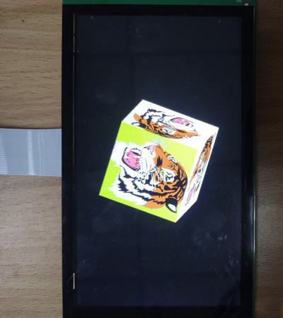

# evkmimxrt1170_18_Cube

Draw a rotating cube with six tigers, then blit it to the center of display that has a black background.

## Hardware Preparation

If using the **MIPI** interface, connect the LCD displayer to **J48** on the MIMXRT1170-EVK board. Connect 5V power to **J43**, set **J38** to **1-2**, and turn on the power switch **SW5**.

## Software Preparation

Now three LCD displayers are supported, which are defined in [**display_support.h**](../common/board/display_support.h):

``` C
#define DEMO_PANEL_RK055AHD091 0 /* 720 * 1280, RK055AHD091-CTG(RK055HDMIPI4M) */
#define DEMO_PANEL_RK055IQH091 1 /* 540 * 960,  RK055IQH091-CTG */
#define DEMO_PANEL_RK055MHD091 2 /* 720 * 1280, RK055MHD091A0-CTG(RK055HDMIPI4MA0) */
```

Use the macro **DEMO_PANEL** to select the LCD panel you are using, the default panel is **RK055AHD091-CTG** configured in the display_support.h:

``` C
#define DEMO_PANEL DEMO_PANEL_RK055AHD091
```

For example, if your LCD panel is **RK055MHD091A0-CTG**, change the macro **DEMO_PANEL** definition as following:

``` C
#define DEMO_PANEL DEMO_PANEL_RK055MHD091
```

The source code is in [**Cube.c**](./source/Cube.c), where the *main* function first configures clocks, pins, etc. **freerots** is deployed in the example. **vglite_task** is created and scheduled to execute VGLite initialization and drawing task. And another task **swapbuf_task** is created and scheduled to set the frame buffer.

[**draw_cube.h**](./source/draw_cube.h) and [**draw_cube.c**](./source/draw_cube.c) files declare functions to load and draw images, such as `load_texture_images`, `vg_lite_set_image`, `draw_cube`, etc. 
In addition, seven **./source/tiger_xxxx.h** files include the bitmap data with tigers on the different background.

## VGLite Initialization

Before drawing, the following function is executed to do initialization:

* **`vg_lite_init`** initializes VGLite and configures the tessellation buffer size, which is recommended to be the size of the most commonly rendered path size. 
In this project, it's defined by

    ``` C
    error = vg_lite_init(TW, TH);
    ```
In this project, the customized function `load_texture_images` calls `vg_lite_set_image`, `vg_lite_linear_to_tiled` and `scale_cube` functions six times to load six tiger images, convert the linear layout to tiled layout, scale the cube, translate and rotate the cube. The key code is

``` C
/* Load the image0 */
vg_lite_set_image(&image0, (uint8_t *)image_data_tiger_lime)
vg_lite_linear_to_tiled(&image0);
...
...

/* Scale the cube to proper size */
cbsize = fb_width / 4.0;
scale_cube(&cube_v0, cbsize);
...
...

/* Translate the cube to the center of framebuffer */
xoff = fb_width / 2.0;
yoff = fb_height / 2.0;

/* Set the initial cube rotation degree and step */
xrot = 20.0;
yrot = 0.0;
zrot = 20.0;
rotstep = 3.0;
```

In customized `vg_lite_set_image` function, the image data is set into the buffer by the following key code:

``` C
/* Get width, height, stride and format info */
buffer->width = TEXTURE_IMAGE_WIDTH;
buffer->height = TEXTURE_IMAGE_HEIGHT;
buffer->stride = TEXTURE_IMAGE_STRIE;
buffer->format = VG_LITE_BGRA8888;
/* Set image data in the buffer */
buffer->handle = NULL;
buffer->memory = img_array;
buffer->address = (uint32_t)img_array;
```

The customized `vg_lite_linear_to_tiled` function sets a temporary buffer *tmpbuf* with the layout mode of **VG_LITE_TILED** defined in the **vg_lite_buffer_layout_t** enumeration. **vg_lite_buffer_layout_t** enumeration includes two values:

* **VG_LITE_LINEAR**: Linear (scanline) layout.

* **VG_LITE_TILED**: Data is organized in 4x4 pixel tiles.

Then `vg_lite_linear_to_tiled` calls the `vg_lite_blit` function is used to convert the linear layout of original buffer to the tiled layout of *tmpbuf*:

``` C
vg_lite_buffer_t tmpbuf;

static uint8_t * pbuf = (uint8_t*)image_data_buf;

tmpbuf.handle = NULL;
tmpbuf.memory = pbuf;
tmpbuf.address = (uint32_t)pbuf;
tmpbuf.tiled = VG_LITE_TILED;

vg_lite_blit(&tmpbuf, buffer, &mat, VG_LITE_BLEND_NONE, 0, filter);
```

And the customized `scale_cube` function scales the cube to proper, the key code is

``` C
/* Scale cube vertex coordinates to proper size */
vertex->x *= scale;
vertex->y *= scale;
vertex->z *= scale;
```

## Drawing Task

In this project, many customized functions are applied: For rendering the rotating cube, a customized `draw_cube` function is used, which calls `transfrom_rotate` function to compute the new cube vertex coordinates, and uses the `transfrom_normalZ` function to compute the surface normal direction for determining the front/back face. The key code is

``` C
/* Rotation angles (degree) for axis X, Y, Z */
compute_rotate(xrot, yrot, zrot, &rotate_3D);
yrot += rotstep;

/* Compute the new cube vertex coordinates transformed by the rotation matrix */
transfrom_rotate(&rotate_3D, &cube_v0, &rv0, xoff, yoff);
transfrom_rotate(&rotate_3D, &cube_v1, &rv1, xoff, yoff);
...

/* Compute the surface normal direction to determine the front/back face */
transfrom_normalZ(&rotate_3D, &normal0321, &nz0321);
transfrom_normalZ(&rotate_3D, &normal4567, &nz4567);
...
```

Then for the images shown front face, `transfrom_blit` function is used to compute transform matrix and then `vg_lite_blit` function blits corresponding images.

``` C
if (nz0321 > 0.0)
{
    /* Compute 3x3 image transform matrix to map a rectangle image (w,h) to
        a parallelogram (x0,y0), (x1,y1), (x2,y2), (x3,y3) counterclock wise.
    */
    transfrom_blit(image0.width, image0.height, &rv0, &rv3, &rv2, &rv1, &matrix);

    /* Blit the image using the matrix */
    vg_lite_blit(rt, &image0, &matrix, VG_LITE_BLEND_SCREEN, 0, filter);
}
```

*vglite_task* and another task *swapbuf_task* communicate using **SemaphoreHandle_t** structure of freertos. When the cube image is blit to the render buffer, *vglite_task* notifies the *swapbuf_task* by the **`xSemaphoreGive`** function. *swapbuf_task* takes the semaphore by **`xSemaphoreTake`**, and then sets new frame buffer. The key code is:

``` C
/* Semaphore to sync between VGlie and display */
static SemaphoreHandle_t semaSwap;

static void vglite_task(void *pvParameters)
{
    while (1)
    {
        if(semaSwap) {
            /* notify the swap task to set new frame buffer */
            xSemaphoreGive(semaSwap);
        }
    }
}

static void swapbuf_task(void *pvParameters)
{
    semaSwap = xSemaphoreCreateBinary();

    while(1)
    {
        if (semaSwap) {
            if (xSemaphoreTake(semaSwap, portMAX_DELAY) == pdTRUE) {
                  VGLITE_SwapBuffers(&window);
            }
        }
    }
}
```

## Run

Compile firstly, and use a Micro-USB cable to connect PC to **J86** on MIMXRT1170-EVK board, then download the firmware and run. 

If it's successful, the correct image will show on the displayer:



And FPS information will be sent through UART serial port continuously. The correct UART configuration is

* 115200 baud rate
* 8 data bits
* No parity
* One stop bit
* No flow control