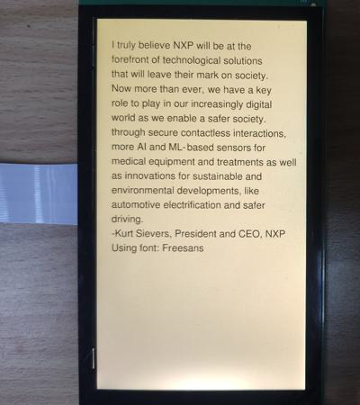

# evkmimxrt1170_19_Font

Draw a paragraph made by Kurt Sievers, President and Chief Executive Officer, NXP. (black text on yellow background, freesans font)

## Hardware Preparation

If using the **MIPI** interface, connect the LCD displayer to **J48** on the MIMXRT1170-EVK board. Connect 5V power to **J43**, set **J38** to **1-2**, and turn on the power switch **SW5**.

## Software Preparation

Now three LCD displayers are supported, which are defined in [**display_support.h**](../common/board/display_support.h):

``` C
#define DEMO_PANEL_RK055AHD091 0 /* 720 * 1280, RK055AHD091-CTG(RK055HDMIPI4M) */
#define DEMO_PANEL_RK055IQH091 1 /* 540 * 960,  RK055IQH091-CTG */
#define DEMO_PANEL_RK055MHD091 2 /* 720 * 1280, RK055MHD091A0-CTG(RK055HDMIPI4MA0) */
```

Use the macro **DEMO_PANEL** to select the LCD panel you are using, the default panel is **RK055AHD091-CTG** configured in the display_support.h:

``` C
#define DEMO_PANEL DEMO_PANEL_RK055AHD091
```

For example, if your LCD panel is **RK055MHD091A0-CTG**, change the macro **DEMO_PANEL** definition as following:

``` C
#define DEMO_PANEL DEMO_PANEL_RK055MHD091
```

The source code is in [**Font.c**](./source/Font.c), where the *main* function first configures clocks, pins, etc. **freerots** is deployed in the example. **vglite_task** is created and scheduled to execute VGLite initialization and drawing task.

In addition, the [**freesans.h**](./source/freesans.h) file stores the data of *Freesans* font.

## VGLite Initialization

Before drawing, several functions are executed to do initialization:

* **`vg_lite_init`** initializes VGLite and configures the tessellation buffer size, which is recommended to be the size of the most commonly rendered path size. 
In this project, it's defined by

    ``` C
	#define DEFAULT_VG_LITE_TW_WIDTH                        128 /* pixels */
	#define DEFAULT_VG_LITE_TW_HEIGHT                       128 /* pixels */

    error = vg_lite_init(DEFAULT_VG_LITE_TW_WIDTH, DEFAULT_VG_LITE_TW_HEIGHT);
    ```

* **`vg_lite_set_command_buffer_size`** sets the GPU command buffer size (optional).

Two new sturctures, **vg_lite_font_params_t** and **vg_lite_font_attributes_t**, appear for configuring the font. 

* **vg_lite_font_params_t** configures the font parameters such as type (`eFontType_t`), weight (`eFontWeight_t`), stretch (`eFontStretch_t`), style (`eFontStyle_t`), height, etc.

    ``` C
    static vg_lite_font_params_t font_params = {
        .font_type      = eFontTypeVector,
        .font_weight    = eFontUltraBlack,
        .font_stretch   = eFontStretchNormal,
        .font_style     = eFontStyleNormal,
        .font_height    = 35
    };
    ```

* **vg_lite_font_attributes_t** structure sets the text attributes like alignment (*eTextAlign_t*), text color, background color, margin, anchor, scale, font height etc.

    ``` C
    static vg_lite_font_attributes_t font_attribs = {
        .justify         = 0,
        .alignment       = eTextAlignLeft,
        .width           = 1200,
        .height          = 50,
        .text_color      = OPAQUE_VGLITE_COLOUR(0, 0, 0), /* black */
        .bg_color        = OPAQUE_VGLITE_COLOUR(0xff, 0xff, 0xff), /* white */
        .tspan_has_dx_dy = 0,
        .margin          = 5,
        .anchor          = 0,
        .scale           = 1,
        .font_height     = 34,
        .last_x          = 0,
        .last_y          = 0,
        .last_dx         = 0
    };
    ```

The **`vg_lite_register_font`** function registers font by prepared structures of **vg_lite_font_t** and **vg_lite_font_params_t**.

``` C
static vg_lite_font_t font = VG_LITE_INVALID_FONT;

// Register font
strcpy(font_params.name, FONT_NAME);

font_params.data        = freesans_vft;
font_params.data_len    = FONT_VFT_LEN;

error = vg_lite_register_font(&font, &font_params);
```

## Drawing Task

In drawing task, there are following functions:

* **`vg_lite_clear`** clears the render buffer with a solid color (**ABGR format**). 
In this project, the full screen is cleared by

    ``` C
    vg_lite_clear(rt, NULL, OPAQUE_VGLITE_COLOUR(0xff, 0xa4, 0x48));
    ```

* **`vg_lite_identity`** resets the specified transformation matrix, which is uninitialized or previously modified by functions of `vg_lite_translate`, `vg_lite_rotate`, `vg_lite_scale`.

* **`vg_lite_translate`** translates draw result by input coordinates with transformation matrix. 


* **`vg_lite_draw_text`** is used to draw text, whose input parameters include target buffer, text to be shown, *vg_lite_font_t* structure, X and Y coordinates, transformation matrix, blend mode, and *vg_lite_font_attributes_t* structure.

In this project, a paragraph is drawn line by line by the following key code:

``` C
vg_lite_identity(&matrix);
vg_lite_translate(50, 100, &matrix);
error = vg_lite_draw_text(rt, "I truly believe NXP will be at the", font, 0, 0, &matrix, VG_LITE_BLEND_SRC_OVER, &font_attribs);

vg_lite_translate(0, 50, &matrix);
error = vg_lite_draw_text(rt, "forefront of technological solutions", font, 0, 0, &matrix, VG_LITE_BLEND_SRC_OVER, &font_attribs);

...
...

```

Once an error occurs, cleaning work is needed including the following functions:

* **`vg_lite_unregister_font`** frees the allocated memory when font is registered:
    ``` C
    vg_lite_unregister_font(font);
    ```

* **`vg_lite_close`** finally frees up the entire memory initialized earlier by the `vg_lite_init` function.

    ``` C
    vg_lite_close();
    ```


## Run

Compile firstly, and use a Micro-USB cable to connect PC to **J86** on MIMXRT1170-EVK board, then download the firmware and run. 

If it's successful, the correct image will show on the displayer:



And FPS information will be sent through UART serial port continuously. The correct UART configuration is

* 115200 baud rate
* 8 data bits
* No parity
* One stop bit
* No flow control