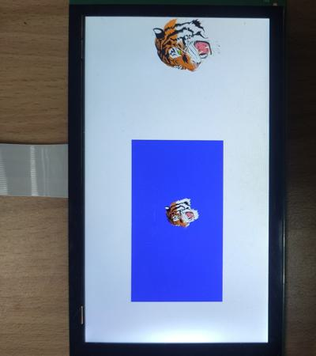

# evkmimxrt1170_20_Multitask

Clear an offscreen with blue color and draw a rotating tiger on it, another rotating and scaling tiger is drawn outside, then blit them to the display that has a white background.

## Hardware Preparation

If using the **MIPI** interface, connect the LCD displayer to **J48** on the MIMXRT1170-EVK board. Connect 5V power to **J43**, set **J38** to **1-2**, and turn on the power switch **SW5**.

## Software Preparation

Now three LCD displayers are supported, which are defined in [**display_support.h**](../common/board/display_support.h):

``` C
#define DEMO_PANEL_RK055AHD091 0 /* 720 * 1280, RK055AHD091-CTG(RK055HDMIPI4M) */
#define DEMO_PANEL_RK055IQH091 1 /* 540 * 960,  RK055IQH091-CTG */
#define DEMO_PANEL_RK055MHD091 2 /* 720 * 1280, RK055MHD091A0-CTG(RK055HDMIPI4MA0) */
```

Use the macro **DEMO_PANEL** to select the LCD panel you are using, the default panel is **RK055AHD091-CTG** configured in the display_support.h:

``` C
#define DEMO_PANEL DEMO_PANEL_RK055AHD091
```

For example, if your LCD panel is **RK055MHD091A0-CTG**, change the macro **DEMO_PANEL** definition as following:

``` C
#define DEMO_PANEL DEMO_PANEL_RK055MHD091
```

The source code is in [**Multitask.c**](./source/Multitask.c), where the *main* function first configures clocks, pins, etc. **freerots** is deployed in the example. Two tasks, **vglite_task** and **vglite_task2**, are created and scheduled, to execute VGLite initialization and drawing task separately. 

In addition, the [**tiger_paths.h**](./source/tiger_paths.h) file stores the path data of tiger.

## VGLite Initialization

Before drawing, several functions are executed to do initialization:

* **`vg_lite_init`** initializes VGLite and configures the tessellation buffer size, which is recommended to be the size of the most commonly rendered path size. 

    ``` C
    error = vg_lite_init(TW / 2, TH / 2);
    ```

* **`vg_lite_set_command_buffer_size`** sets the GPU command buffer size (optional).

* **`vg_lite_allocate`** allocates the render buffer, whose the input parameter is **vg_lite_buffer_t** structure defining width, height, and color format, etc.

In the *vglite_task*, the second task is created, such as 

``` C
xTaskCreate(vglite_task2, "vglite_task", configMINIMAL_STACK_SIZE + 200, NULL, configMAX_PRIORITIES - 1, NULL)
```

Once `vglite_task2` is executed, its initialization part is applied first for drawing the second tiger, including functions of `vg_lite_init` and `vg_lite_set_command_buffer_size`. And a buffer array `tmp_buf[3]` is configured and allocated for subsequent drawing:

``` C
for (i = 0; i < 3; i++)
{
    tmp_buf[i].width = DEMO_BUFFER_WIDTH / 2;
    tmp_buf[i].height = DEMO_BUFFER_HEIGHT / 2;
    tmp_buf[i].tiled  = VG_LITE_LINEAR;
    tmp_buf[i].format = VG_LITE_BGR565;
    error = vg_lite_allocate(&tmp_buf[i]);
}
```
 
## Drawing Task

In drawing task, there are following functions:

* **`vg_lite_clear`** clears the render buffer with a solid color (**ABGR format**). 

* **`vg_lite_identity`** resets the specified transformation matrix, which is uninitialized or previously modified by functions of `vg_lite_translate`, `vg_lite_rotate`, `vg_lite_scale`.

* **`vg_lite_draw`** performs a 2D vector draw operation, drawing input path data with the specified fill rule, transformation matrix, blend mode, and fill color, etc. 

* **`vg_lite_translate`** translates draw result by input coordinates with transformation matrix. 

* **`vg_lite_blit`** finally copies the source image to the destination window with the specified blend mode and filter mode, determining the showing of objects. 

In this project, `vglite_task` fills the whole screen with the white color by `vg_lite_clear` function, and then calls `vg_lite_draw` to draw path data of the tiger which is rotated and scaled every time:

``` C
vg_lite_clear(rt, NULL, 0xFFFFFFFF);

for (count = 0; count < pathCount; count++)
{
error = vg_lite_draw(rt, &path[count], VG_LITE_FILL_EVEN_ODD, &matrix, VG_LITE_BLEND_NONE, color_data[count]);
}
vg_lite_blit(rt, &tmp_buf[(index+2) % 3], &mat,VG_LITE_BLEND_NONE, 0, VG_LITE_FILTER_POINT);

if (zoomOut)
{
    vg_lite_scale(1.25, 1.25, &matrix);
    if (0 == --scaleCount)
        zoomOut = 0;
}
else
{
    vg_lite_scale(0.8, 0.8, &matrix);
    if (5 == ++scaleCount)
        zoomOut = 1;
}

vg_lite_rotate(-1.5, &matrix);
```

`vglite_task2` clears the `tmp_buf[index]` with blue color, and draws another tiger to it, which keeps rotating by 0.5 degrees:

``` C
// Initialize the draw.
error = vg_lite_init(DEMO_BUFFER_WIDTH / 2, DEMO_BUFFER_HEIGHT / 2);

while (1)
{
    index = index % 3;
    // Draw the path using the matrix.
    vg_lite_clear(&tmp_buf[index], NULL, 0xFFFF0000);
    for (count = 0; count < pathCount; count++)
    {
        error = vg_lite_draw(&tmp_buf[index], &path[count], VG_LITE_FILL_EVEN_ODD, &matrix2, VG_LITE_BLEND_NONE, color_data[count]);
    }
    index++; 

    vg_lite_rotate(0.5, &matrix2);
}
```

And then in `vglite_task`, the buffer *tmp_buf* including the tiger in the blue rectangle will be blit to the screen by

``` C
vg_lite_blit(rt, &tmp_buf[(index+2) % 3], &mat,VG_LITE_BLEND_NONE, 0, VG_LITE_FILTER_POINT);
```

Once an error occurs, cleaning work is needed including the following functions:

* **`vg_lite_clear_path`** clears path data uploaded to GPU memory.

    ``` C
    for (i = 0; i < pathCount; i++)
    {
        vg_lite_clear_path(&path[i]);
    }
    ```

* **`vg_lite_close`** finally frees up the entire memory initialized earlier by the `vg_lite_init` function.

    ``` C
    vg_lite_close();

## Run

Compile firstly, and use a Micro-USB cable to connect PC to **J86** on MIMXRT1170-EVK board, then download the firmware and run. 

If it's successful, the correct image will show on the displayer:



And FPS information will be sent through UART serial port continuously. The correct UART configuration is

* 115200 baud rate
* 8 data bits
* No parity
* One stop bit
* No flow control